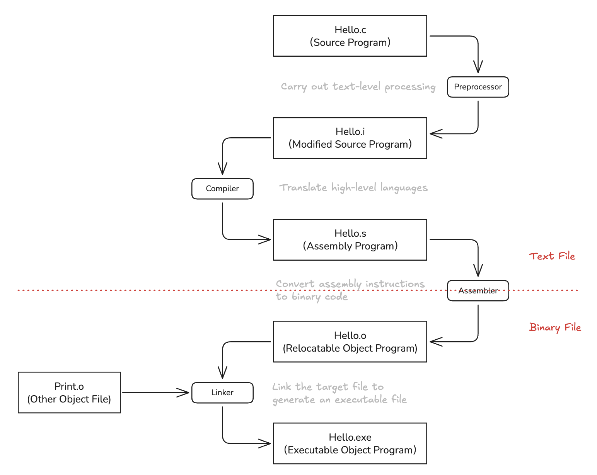
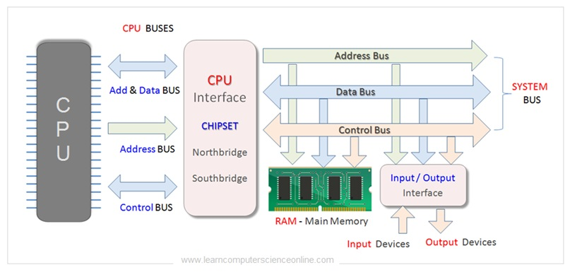
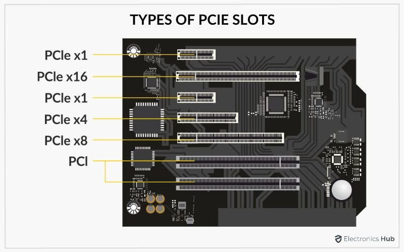
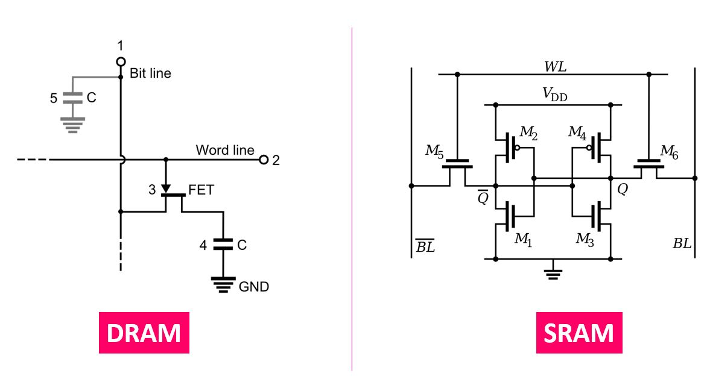
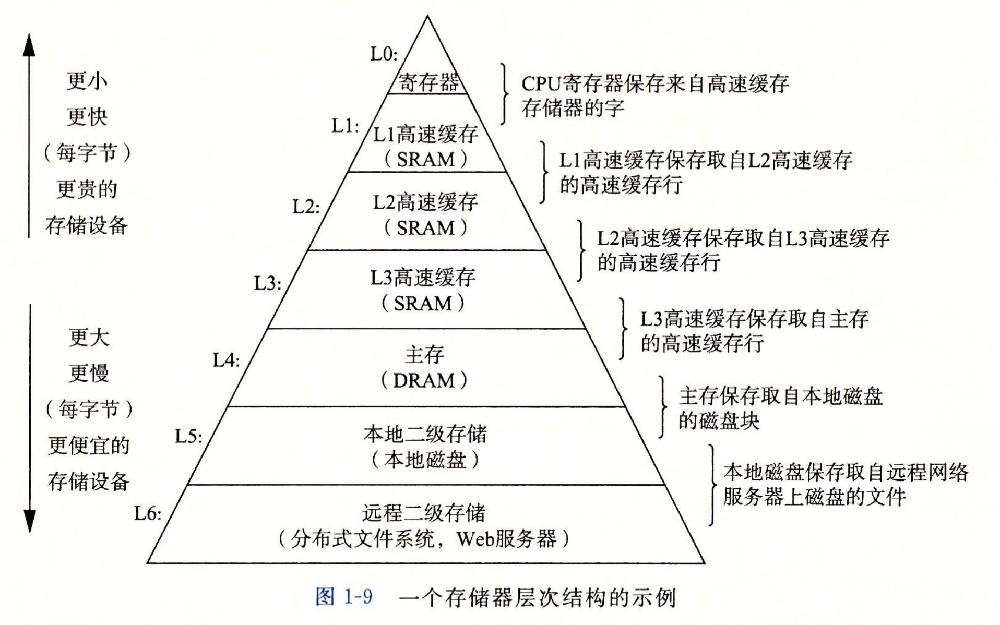
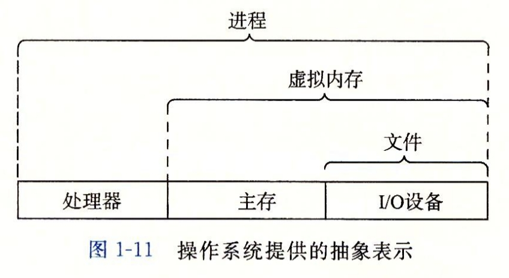
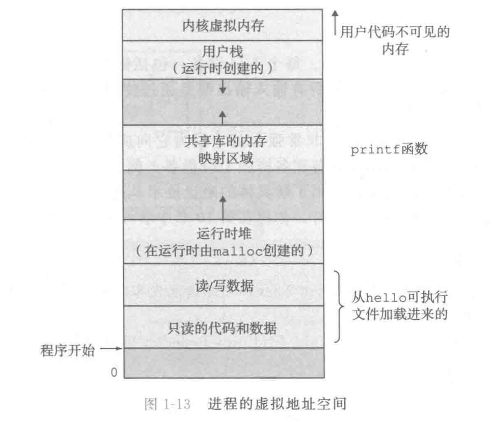

# 第一章 - 计算机系统漫游

> 第一章以 `hello_world.c` 程序的编译与运行流程为例，引出该工作流程中计算机系统软硬件所扮演的角色与作用——这也正是本书将要探讨的内容，旨在从一个贴近实际编码的层面，为读者提供计算机编程的宏观视野

### 有趣的思想：信息就是位+上下文

说实话，我之前一直没有认真思考过信息的本质是什么，大脑只是在生活经验的驱使下有个模糊的了解：说的话是信息、书籍上的文字是信息、视频是信息...现在看到书上的定义，联想到之前的模糊认知，大脑瞬间明了了起来：计算机中的信息是“位+上下文”，扩大到生活中，生活中的信息同样也就是“文字+语境”，再更宽泛一点，就是“载体+环境”。

只有在同一个规定的信息体系下面的内容，才能传达有意义的信息，但不管怎样的语言，同一段内容在不同的环境中存在有不同的含义，为了准确内容呈现出来的意义，就必须将其所处的环境结合起来，这样就组成了完整的信息。

同样的，在计算机中，我们规定内容的载体是二进制01码，不同的01组合序列对应具体不同的内容。对于固定的序列数 n，01的组合数量是一定的（通常为$2^{n-1}$ ）。与现实中庞大的信息相比，一定存在序列与信息一对多的情况。于是，为了准确序列的含义，我们必须在解读载体的同时与其所在环境联系起来，最终解读出最准确的信息。

例如，在计算机中，对于同样的二进制序列68（01000100），在字符编码的环境下解释是‘h’，在汇编码中又被看作为“push”指令（将指定的值压入栈中），同时，在不同的程序中，它又被看作数字的68，亦或者图像中的灰度值....

#### Point：只有ASCLL字符构成的文件**称为**文本文件，所有其他文件都称为二进制文件

**文本文件是用标准的字符编码体系作为解释层的二进制文件**

> 所有文件在存储和传输层面都表现为二进制数据（0和1）。所谓的“文本文件”和“二进制文件”的区分，并不在于底层存储介质的物理形态，而在于逻辑层面的解释规则。

### 程序的编译流程

> 程序的编译流程系统学习部分详见《编译原理》一书。编译是计算机系统的重要组成部分，包含许多艰深的理论。没想到 CSAPP 在作为引言的章节中就将其提出来讲解。虽然没有详细介绍具体概念，但也精炼地指出了程序设计需要了解的基本流程，为编程新手揭开了程序编译细节的面纱。不得不感慨，难怪世人皆称赞 CSAPP 为程序员的神书，确实是有其独到之处的。

程序从编写到可执行文件大致分为以下几个流程：

源程序（program.cpp，高级语言编写的文本文件）

【预处理器，删除注释、宏定义与替换、文件包含、条件编译等操作，进行文本级的处理】→ 预处理文件（hello.i）

【编译器，ccl，词法分析、语法分析、语义分析、代码（汇编码）生成】→ 汇编文件（hello.s）

【汇编器，as，将汇编程序转化为目标机器的二进制码】→目标文件（ hello.o）

【链接器，dl，链接需要的文件或库并生成可执行二进制文件】 → 可执行文件（hello/hello.exe）



### Shell ：命令行解释器

shell是一个命令行解释器，它输出一个提示符，等待输入一个命令行，然后执行这个命令。

如果该命令行中的第一个单词不是shell内置的指令，shell会默认将其当作可执行文件的名字，它将加载并运行这个文件。

> gcc 等工具不是 shell 内置指令，因此shell会将其当作可执行文件进行加载并运行。shell会默认先从PATH中寻找可执行文件的绝对路径，只有在PATH中找到可执行文件对应的路径，命令才能被正常执行（或者在命令行中直接输入可执行文件的绝对路径），这就是为什么某些工具下载后需要将其bin目录所在的路径导入PATH中，如果不导入PATH，shell将永远不会自动找到程序可执行文件的位置，除非用户手动传入（那样太麻烦了）。

### 总线与字

总线是贯穿整个系统的一组电子管道，它负责在 CPU、内存、I/O 设备等各个部件之间传递信息。

通常，总线被设计成传输特定字长的字节块，这个基本的传输单位就是“字”（Word）。

需要清楚的是，“字”是硬件数据传输的基本单位，但计算机中数据的最小单位是“位”（bit）。我们常说的 64 位或 32 位机器，指的是其“字长”（字的比特数量），即 CPU 和内存之间传输数据的基本宽度：

- 32 位机器：字长为 32 位，即 4 字节。
- 64 位机器：字长为 64 位，即 8 字节。



> 详细内容见：[https://blog.csdn.net/m0_59860403/article/details/128093173](https://blog.csdn.net/m0_59860403/article/details/128093173)

### 计算机系统的硬件构成

#### 总线

总线是一组能为多个部件分时共享的公共信息传送线路。

> 共享是指总线上可以挂接多个部件，各个部件之间互相交换的信息都可以通过这组线路分时共享。
>
> 分时是指同一时刻只允许有一个部件向总线发送信息，如果系统中有多个部件，则它们只能分时地向总线发送信息。

总线可以分为内部总线、系统总线以及 I/O 总线三大类。

内部总线（Internal Bus）分布在 CPU 内部，连接 CPU 内部的各个组分（例如 CU、ALU 以及 Register），具有距离极短、速度极快的特点。

系统总线（System Bus）连接着 CPU 与主存储器（内存），CPU 通过总线接口与 I/O 桥接器相连，再通过内存总线与主存通信。系统总线在功能上又细分为以下三类：

- 数据总线（Data Bus）：负责在 CPU 和内存之间实际搬运数据
- 地址总线（Address Bus）：CPU 用来告诉内存“我要访问哪个地址的数据”
- 控制总线（Control Bus）：传输控制信号，比如读/写命令、中断请求等

> 数据总线决定了单次传输的数据位数，比如 64 位系统的字长。
>
> 地址总线决定了寻址能力和最大支持的内存容量，不一定和字长匹配。
>
> 控制总线往往小于字长，大小取决于 CPU 架构和总线协议。

I/O 总线（I/O Bus）连接各种外部设备（如网卡、图形加速卡等）。

> 在进行高性能计算或异构编程时，将计算任务从主机端卸载到设备端去执行，主机内存和 GPU 显存之间的大规模数据拷贝，依赖的就是主板上的 PCIe 扩展总线。PCIe 总线的带宽和延迟，往往直接影响着底层程序优化的上限。



主板上的 PCIe 插槽。

#### I/O设备

I/O 设备（Input/Output Devices）是计算机系统中用于与外部世界进行信息交换，或进行数据持久化存储的硬件部件。一般而言，I/O 设备由两个部分组成，分别是物理设备以及设备控制器。物理设备是实际进行数据输入输出的主体。

#### 主存

主存是一个临时存储设备，在处理器执行程序时，用来存放程序和程序处理的数据。

从物理上来说，主存是由一组动态随机存取存储器（Dynamic RAM）芯片组成的。从逻辑上来说，存储器是一个线性的字节数组，每个字节都有其唯一的地址（数组索引），这些地址是从零开始的。

动态随机存取存储器与静态随机存取存储器（Static RAM）均属于计算机存储器体系的重要组成部分，具有易失性以及随机存取特点。

DRAM 的核心特性在于**高密度与低成本**。其基本存储单元通常由“一个晶体管加一个电容（1T1C）”构成，通过电容内部是否带有电荷来表征二进制数据。这种极简的物理结构使其具备极高的集成度，能够以较低的制造成本实现海量存储。然而，由于微电容存在物理漏电现象，系统必须对其进行高频的周期性刷新（Refresh）以维持数据状态。这种动态刷新机制以及电容的充放电过程，导致 DRAM 的存取延迟相对较高。在系统架构中，它主要承担大容量**主存（Main Memory）**的角色。

SRAM 的核心特性在于**极低延迟与高稳定性**。其基本存储单元通常由六个晶体管（6T）构成的双稳态触发器电路组成。只要系统维持供电，该电路就能静态、稳定地锁定数据状态，无需任何外部刷新操作。这种纯粹的电平切换机制使其存取速度极快，访问延迟可低至纳秒级，能够与现代处理器的时钟频率良好匹配。但复杂的电路结构导致其占用芯片面积大、集成度低且制造成本极其昂贵。因此，SRAM 主要用于构建容量有限但速度要求极高的**高速缓存（L1/L2/L3 Cache）**。



DRAM 与 SRAM 的硬件电路设计图。

在经典的**存储器层次结构（Memory Hierarchy）**中，SRAM 被部署在靠近 CPU 的内层，用于消除计算核心与存储系统之间的速度壁垒；DRAM 则被部署在外围，用于满足系统对庞大工作集的数据容量需求。两者通过软硬件层面的局部性原理相互配合，共同平衡了计算机系统的性能与硬件成本。

#### 处理器

中央处理单元（CPU），简称处理器，是解释（或执行）存储在主存中指令的引擎。处理器的核心是一个大小为一个字的存储设备（或寄存器），称为程序计数器（PC）。在任何时刻，PC 都指向主存中的某条机器语言指令（即含有该条指令的地址）。

从系统通电开始，直到系统断电，处理器一直在不断地执行程序计数器指向的指令，再更新程序计数器，使其指向下一条指令。处理器看上去是按照一个非常简单的指令执行模型来操作的，这个模型是由指令集架构决定的。在这个模型中，指令按照严格的顺序执行，而执行一条指令包含执行一系列的步骤。处理器从程序计数器指向的内存处读取指令，解释指令中的位，执行该指令指示的简单操作，然后更新 PC，使其指向下一条指令，而这条指令并不一定和在内存中刚刚执行的指令相邻。

> 一般而言 CPU 处理一条指令的操作流是：取指→译码→执行→返回。

### 高速缓存 cache

#### 高速缓存的必要性

针对处理器与主存之间（数据处理速度）的差异，系统设计者采用了更小更快的存储设备，称为高速缓存存储器（cache memory，简称为 cache 或高速缓存），作为暂时的集结区域，存放处理器近期可能会需要的信息。位于处理器芯片上的 L1 高速缓存的容量可以达到数万字节，访问速度几乎和访问寄存器文件一样快。一个容量为数十万到数百万字节的更大的 L2 高速缓存通过一条特殊的总线连接到处理器。进程访问 L2 高速缓存的时间要比访问 L1 高速缓存的时间长 5 倍，但是这仍然比访问主存的时间快 5~10 倍。L1 和 L2 高速缓存是用一种叫做静态随机访问存储器（SRAM）的硬件技术实现的。比较新的、处理能力更强大的系统甚至有三级高速缓存：L1、L2 和 L3。系统可以获得一个很大的存储器，同时访问速度也很快，原因是利用了高速缓存的局部性原理，即程序具有访问局部区域里的数据和代码的趋势。通过让高速缓存里存放可能经常访问的数据，大部分的内存操作都能在快速的高速缓存中完成。

> 根据机械原理，较大的储存设备比较小的储存设备运行得慢，而快速的储存设备造价远高于同类低速储存设备。而随着行业的发展，处理器与主存之间运行的速度差异变得更加显著，为了适应计算和访存之间的差距，系统设计者 trade-off 的结果是选择采用更小更快的储存器进行缓冲，存放处理器暂时需要的信息。

#### 存储器层级结构

为了解决存储空间大小与数据读取速度之间的差异，计算机系统利用程序数据访问时间局部性以及空间局部性原理，引入了存储器层级结构。



> 时空局部性（Spatio-temporal Locality）是计算机程序在执行时普遍表现出的一种访存规律。时间局部性指出刚刚被访问过的数据或指令在极短的时间内大概率会被再次高频访问（如循环控制变量），而空间局部性则表明一旦某个内存位置被访问，其物理地址周边的相邻数据在不久的将来有较大概率被访问（如数组的连续遍历）。为了利用这一客观规律，底层硬件引入了 SRAM 构建的 Cache，不仅将具有时间局部性的“热点数据”暂时驻留在距离 CPU 最近的地方，还以“缓存行（Cache Line）”为基本单位将具有空间局部性的连续数据打包预取；这种软硬件层面的配合，有效缓解了 DRAM 主存读取延迟的问题。

### 操作系统与硬件

操作系统是位于计算机底层硬件与上层应用软件之间的中间层。它通过硬件抽象机制屏蔽了底层物理设备的复杂性与架构差异，向上层应用提供统一、标准化的系统调用接口，同时负责系统资源的高效调度与管理。

#### 操作系统概念与硬件的映射关系

文件 → I/O

虚拟内存 → 主存 + I/O

进程 → 处理器 + 主存 + I/O



### 进程

进程是操作系统调度的基本单位。

#### 进程的并发运行与上下文切换

进程是操作系统对正在运行的程序的一种抽象。

在操作系统中，我们观察到许多进程是在并发（concurrent）运行。在**单核系统**中，这并非物理上的“同时执行”，而是通过分时（time-slicing）技术实现的。

微观上进程是交替执行的：一个进程占据一个 CPU 执行一个时间片，然后内核将其挂起执行另外一个进程。这种快速交替在宏观上营造了一种“同时运行”的假象。

这里存在一个物理限制，那就是一个 CPU 核心在任意时刻都只拥有一套硬件上下文（包括 PC 寄存器、通用寄存器等），只能维持一个 CPU 的执行状态。

因此，当内核决定从当前进程转换到另一个进程时，必须将当前进程的寄存器值、栈指针状态等信息保存到内存（PCB/内存栈），并从内存中加载新进程之前保存的状态信息到 CPU 寄存器中，这个由内核管控的 CPU 控制权切换的过程就被称为“上下文切换”。

### 线程

我们可以把线程看作“微进程”，是操作系统资源分配的基本单位，也是实际执行任务的最小单位。对于同一进程的多个线程而言，线程都运行在进程的上下文中，线程之间共享同样的代码和全局数据。

### 虚拟内存

虚拟内存存在的意义是为了给程序提供统一而简单的寻址方式，并给内存提供安全保护，由于每个进程看到的内存都是一致的，因此得名“虚拟内存”。

#### 虚拟地址空间分布

虚拟内存是进程中最重要的概念之一，对于程序员而言，最重要的不是了解学习相关概念，而是牢记虚拟地址空间分布，为以后代码 bug 定位打下基础。

进程的虚拟空间主要分为六个部分，从下到上依次为：

BIOS 固定初始化空间、程序代码和数据空间、堆空间、共享库空间、栈空间以及内核虚拟内存。

BIOS 固定初始化空间是用来存储计算机开机初始化信息的参数和代码，除 BIOS 外程序均不能修改；在 BIOS 固定初始化空间之上就是存放程序只读的代码以及数据的空间，该空间在程序运行时便已经指定了大小；第三层则是程序运行时由 malloc 创建的堆空间；第四层用来储存共享库的数据和代码；第五层则是栈空间，用来存放函数调用信息，随着程序运行而动态变化；第六层内核虚拟内存用来储存进程 PCB 等进程上下文数据。



### 文件

文件就是字节序列，仅此而已。每个 I/O 设备，包括磁盘、键盘、显示器，甚至网络，都可以看成是文件。系统中的所有输入输出都是通过使用一小组称为 Unix I/O 的系统函数调用读写文件来实现的。

> 语境中对“文件”的广义定义，源自操作系统核心的架构设计理念。操作系统通常会在底层物理硬件与上层应用之间，构建诸如虚拟文件系统（VFS, Virtual File System）的中间抽象层。该层有效地屏蔽了底层硬件运转的繁杂细节以及特定的驱动指令调用，转而向上层提供了一套标准且统一的操作接口。基于这种机制设计，系统中的 I/O 设备往往能够被合理地抽象，进而作为“文件”被统一管理和交互。

文件这个简单而精致的概念是非常强大的，因为它向应用程序提供了一个统一的视图，来看待系统中可能含有的所有各式各样的 I/O 设备。例如，处理磁盘文件内容的应用程序员可以非常幸福，因为他们无须了解具体的磁盘技术。进一步说，同一个程序可以在使用不同磁盘技术的不同系统上运行。你将在第 10 章中学习 Unix I/O。

### Amdahl 定律

阿姆达定律揭示了程序局部加速对整体的影响：当我们对程序部分加速时，其对程序整体的性能提升取决于该部分在程序中的重要性以及加速程度，公式表示如下。

$$
S = \frac{1}{(1-\alpha) + \frac{\alpha}{k}}
$$

其中 $\alpha$ 为系统某部分执行时间与系统总体运行时间之比，$k$ 为该部分取得的加速效果。

阿姆达定律告诉我们，要显著加速一个系统，必须对该系统中的大部分取得相当大的提升。

> 这也是为什么我们对程序进行优化时，需要定位热点函数的原因。

### 并发与并行

> 并发是宏观上的“并行”，微观上的“串行”，本质是时间片快速流转产生的认知差异。

在学习操作系统时，并行与并发被看作两个差异较大的概念。并行为同一时间执行不同的工作流，并发为同一时间执行一个工作，但切换时间够快，使宏观表现为多个工作同时进行。

而在 CSAPP 中，并行和并发被看作两个关系紧密的概念，并发为并行的包含关系。

> “并发（Concurrency）是一个通用的概念，指一个同时具有多个活动的系统；而术语并行（Parallelism）指的是用并发来使一个系统运行得更快。”

并发是一种**程序设计模式**。指的是程序被设计成多个独立的、逻辑上重叠的任务。哪怕只有一个 CPU 核心，只要程序是多线程的，它就是并发的；并行是一种**硬件执行状态**，指的是在同一物理时刻，多个指令在不同的硬件上同时运行。

对相同定义的不同理解的本质是由于观察视角的差异。在操作系统中，从串行到并发到并行，两个新概念的同时出现极易带来混淆，为了帮助接受新的概念，那里主要是从二者在处理器任务处理的角度进行区分；而 CSAPP 部分则是从程序设计的角度进行解释，程序并行的前提一定伴随着并发的结构设计。无论从哪个角度去理解，并发就是并发而并行依旧是并行，横看成林侧成峰，不要被其表面所迷惑，抓住其“山”的本质即可走出困惑。

### 线程级并发

#### 单/多处理器系统

单处理器与多处理器的系统区别，核心在于是否只具备一个中央处理器。

> 需要注意的是，在现代语境下，“处理器”并不等同于物理上的 CPU 插槽（Socket），而是指 Socket 中能够独立执行指令的底层运算单元。

处理器通常被细分为物理核心与逻辑核心。得益于同时多线程（如超线程）技术，一个物理核心往往可以并发运行 2 个硬件线程，在逻辑上即被视为 2 个逻辑核心。因此，**物理核心**代表 Socket 中实际流片的计算单元数量，而**逻辑核心**则代表系统实际能够同时维持并运行的线程上下文数量。

单处理器系统：通常指仅包含一个主中央处理器来执行通用指令集的计算机系统。在此架构下，系统的核心计算任务、进程调度以及宏观硬件控制，主要依赖该单一处理器进行统筹完成。

多处理器系统：指在一个系统架构内，包含两个或两个以上在物理层级互联的处理器。它们往往平等或协同地共享计算机的系统总线、系统时钟、主存储器以及各类外围 I/O 设备，从而实现硬件级别的物理并行。

#### 超线程

又被称为“多线程”，指允许一个 CPU 控制多个控制流的技术。

> 为什么超线程技术能提高 CPU 的利用率？

常规 CPU 会花费大约 20000 个时钟周期（Cycle）去进行不同线程间的切换，使用超线程技术的 CPU 可以在单个时钟周期的基础上决定要执行哪一个线程，使得 CPU 能够更好利用它的处理资源。

> 使用超线程技术的 CPU 具有两套状态寄存器和 PC，因此可以在**已加载的两个逻辑线程之间**，仅 1 个时钟周期完成切换。这使得 CPU 能在某个线程等待内存数据（Stall）的瞬间，立即无缝跳转到另一个线程工作，从而填补流水线空缺，极大提高处理资源利用率。
>
> 超线程 CPU 硬件设计的目的是为了削减线程切换带来的开销，最大程度消除 pipeline 气泡，可以看作指令层的“高速缓存设计”。

#### 多核处理器

一个集成了多个物理核心的集成电路芯片被称为一个多核处理器（对应一个 socket）。

### 指令级并行

#### 指令流水线

CPU 执行一条指令分为多个阶段，各个阶段使用不同的硬件设备，不同硬件设备可以同时运行。为了提高 CPU 利用率，让硬件每时每刻都在运转，CPU 在运行多个指令时，会将指令平行排布，每一时钟周期同时执行多条指令相异阶段，这样的线性排布被称为指令流水线。

```Shell
时钟周期
       1   2   3   4   5   6   7
指令1  [F] [D] [E] [M] [W]
指令2      [F] [D] [E] [M] [W]
指令3          [F] [D] [E] [M] [W]
       ^   ^   ^   ^   ^
       |   |   |   |   |
硬件   F   D   E   M   W  (硬件每时每刻都在忙)
```

采用指令流水线策略的处理器能够达到一个**接近**于一个时钟周期一个指令的执行速率。

#### 超标量处理器

如果一个处理器能够达到一个时钟周期超过一个指令的处理速率，就称之为**超标量处理器**（大多数现代处理器都支持超标量操作）。

### 单指令多数据并行

> 处理器上的一些特殊硬件，一条指令可以处理多个数据。利用此硬件进行的操作在弗林分类法中被称之为单指令多数据并行（SIMD）。

## 小结

【计算机系统的组成、程序的生命周期】计算机系统是由硬件和软件组成的，它们共同协作以运行应用程序。计算机内部的信息被标识为一组组的位，它们以及上下文有不同的解释方式。程序被其他程序翻译成不同的形式，开始是 ASCLL 文本，然后被编译器和链接器翻译成二进制可执行文件。

【围绕计算单元的硬件设计】处理器读取并解释存放在主存里的二进制指令。因为计算机花费了大量的时间在内存、I/O 设备和 CPU 寄存器之间复制数据，所以将系统中的存储设备划分为层次结构——CPU 寄存器在顶部，接着是多层的硬件高速缓存存储器、DRAM 主存和磁盘储存器。在层次模型中，位于更高层的存储设备比低层的储存设备要更快，单位比特造价也更高。层次结构中较高层次的存储设备可以作为较低层次设备的高速缓存。通过理解和运用这种储存层次结构的知识，我们可以优化 C 程序的性能。

【操作系统与计算机硬件】操作系统内核是应用程序和硬件之间的媒介。它提供三个基本的抽象：1）文件是对 I/O 设备的抽象；2）虚拟内存是对主存和磁盘的抽象；3）进程是处理器、主存和 I/O 设备的抽象。

【计算机网络】最后，网络提供了计算机系统之间通信的手段。从特殊系统的角度来看，网络就是一种 I/O 设备。

## 题外话

#### 阿姆达哲学

阿姆达定律折射出来的是一个整体观和重要性的问题，即对于一个系统整体而言，良好的改变必然伴随着大量重要组分的优越提升，**卓越的局部并不能代偿系统性的平庸，大量平庸的改变也难以对整体做出贡献**。这是一个普世的道理。对于一个人而言，想要变得更好，不能只抓住一个有限的点去改变，就如木桶效应所示，即使其中的一块木板再长，也会被其他的短板所限制。相反，我们应该着眼于对自己影响更大、更重要的事物，通过对其大量的调整，获得整体性的显著提升。

现阶段的我人生陷入了瓶颈：情绪低迷、意志消沉、逃避问题、躺平摆烂，丧失了积极进取的勇气，就像《山月记》中的李徵，既深信自己并非璞玉，因而不肯刻苦琢磨，却又确信自己是块美玉，故不肯庸庸碌碌同瓦砾为伍。如此矛盾的心态让我无法甘心沉沦，渴望找到突破点去改变自己，于是强迫自己采取诸如看书、健身、早起等方式去“提升”。然而，由于此前沉沦时养成的坏习并未解除、暗疾仍在，对待这些尝试往往是三分热度——开始时激情满怀，逐渐身心劳累，继而找各种理由推脱，直至最后彻底放弃。这种“不甘沉沦-自寻出路-自我懈怠”的循环是可怕的。每次鼓起勇气尝试去 refresh，却又不断放弃，不断消磨自己的勇气和信心，使人越陷越深...

今夜借着阿姆达定律静静思考，才意识到自己的出发点存在错误。我太渴望回到之前那个积极向上、内心光明、对生活充满勇气的自己，试图通过某些显著改变的行为让自己焕发新生，却因认知上的局限，未能意识到这些零散的尝试会因旧有习惯的顽固而失败。我曾读过一本书，书名很有意思，叫做《原子习惯》（Atomic Habit）。全书的核心观点是：生活中的细节与习惯就像构成我们的原子，塑造了我们方方面面的状态；每一个微小习惯的改变，都会在潜移默化中带来巨大的转变。对人而言，阿姆达定律中的“重要组分”正是这一个个的习惯，只有将其中大部分关键习惯真正转变，才能推动作为整体的自我发生改变。

不过话又说回来，我们该从哪些习惯入手，又该如何有效改变自己的习惯呢？留给明天去解决吧，天色已晚，暂且休息。
