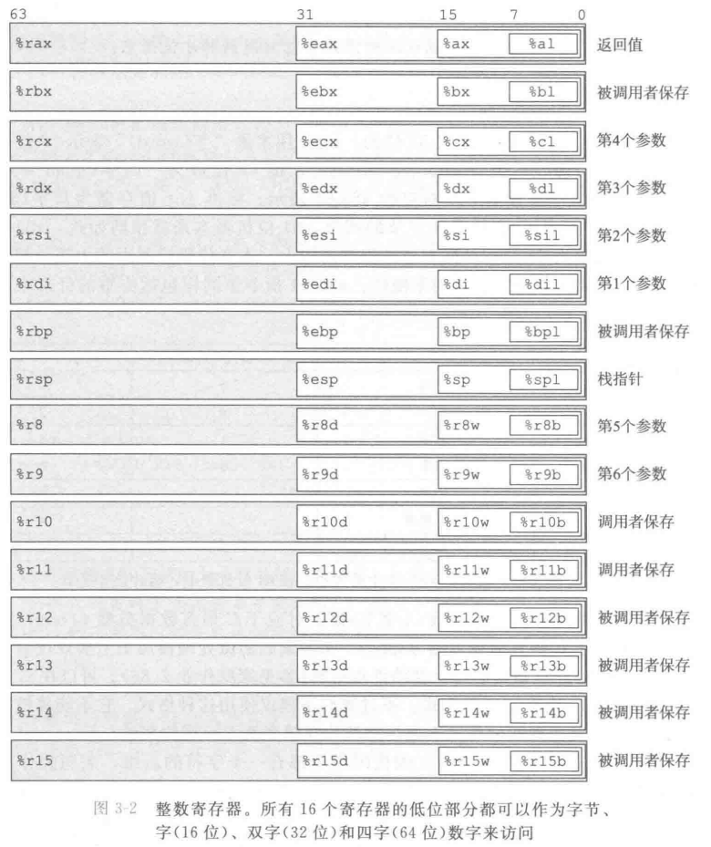
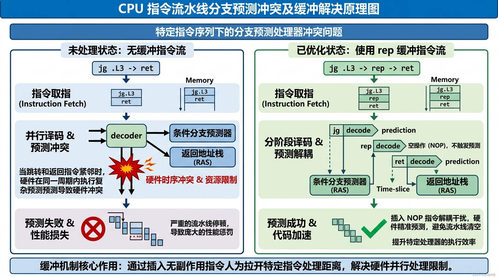
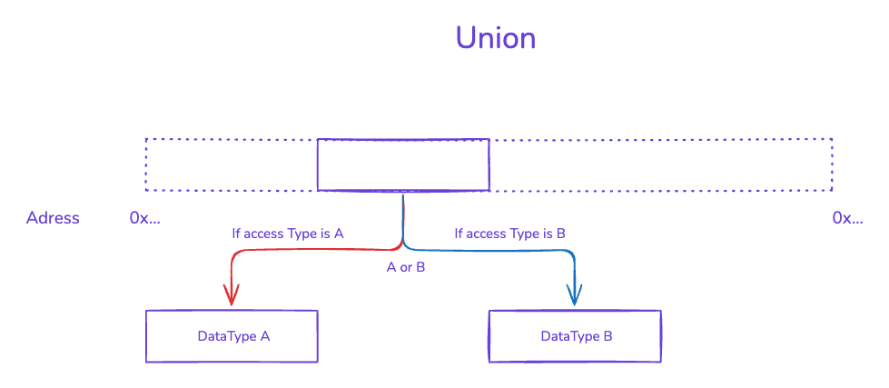
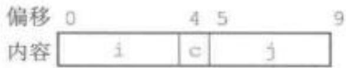
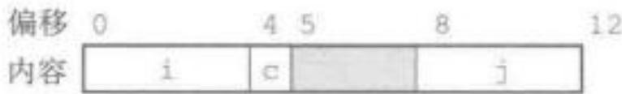
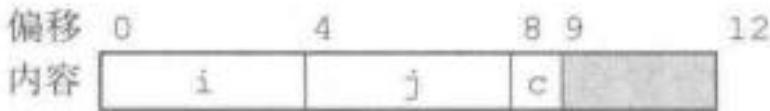

# 第三章 - 程序的机器级表示

## 程序编码

### 机器级代码

代码编译-运行流程解析以及注意事项

汇编与反汇编

### 数据格式

由于 Intel 机器是由 16 位体系结构拓展为 32 位的，所以 Intel 用术语“字（word）”表示16位数据类型。因此，称32 位数为“双字（double words）”，称64位数为“四字（quad words）”



### 访问信息

intel cpu 寄存器的发展历程以及目前的硬件信息

### 操作数指令符


操作数可以看作获取地址值的一种固定计算方式

### 数据传输指令

"最频繁使用的指令是将数据从一个位置复制到另一个位置的指令。**操作数表示的通用性使得一条简单的数据传送指令能够完成在许多机器中要好几条不同指令才能完成的功能。**我们会介绍多种不同的数据传送指令，它们或者源和目的类型不同，或者执行的转换不同，或者具有的一些副作用不同。在我们的讲述中，把许多不同的指令划分成指令类，每一类中的指令执行相同的操作，只不过操作数大小不同。"

> 在 x86-64 架构中，操作数不仅仅是一个单纯的存放数据的容器代号（如某个特定的寄存器），也不仅仅是一个死板的绝对内存地址。它可以被写成一个包含了基址、变址、比例因子和固定偏移量的复合代数表达式。当 CPU 执行一条带有这种复杂操作数的数据传送指令时，它并不是只做“搬运”这一件事。CPU 内部专用的地址生成单元（AGU）会在数据真正开始传输之前，自动在硬件电路上并行执行一系列数学运算：它会将变址寄存器中的值乘以比例因子，再加上基址寄存器中的值，最后再加上立即数偏移量，从而一步到位地计算出最终的有效物理地址。

如果我们把同样的数组或结构体访问任务放到传统的精简指令集（如早期的 ARM 或 MIPS）机器上，过程将被迫拉长。因为这类机器的访存指令通常只接受最基础的寻址方式，它们的操作数不具备这种算术“通用性”。为了算出相同的目标地址，机器必须按部就班地执行多条独立的指令：第一条指令专门调用算术逻辑单元执行乘法或移位以计算偏移跨度，第二条指令执行加法将跨度与基地址汇合，等到地址完全算好并存入某个临时寄存器后，第三条指令才能真正执行内存的数据加载或存储。

因此，操作数的通用性实际上是将“地址算术计算”和“数据物理传送”这两种截然不同的操作，强行糅合进了同一条指令的生命周期内。这种高度紧凑的指令编码方式，使得一条简单的传送指令就能代理其他机器上需要算术指令和访存指令配合才能完成的复杂逻辑，极大地提高了单条指令的代码密度和表达能力。

“源操作数指定的值是一个立即数，存储在寄存器中或者内存中。目的操作数指定一个位置，要么是一个寄存器，要么是一个内存地址。x86-64 加了一条限制，传送指令的两个操作数不能都指向内存位置。将一个值从一个内存位置复制到另一个内存位置需要两条指令——第一条指令将源值加载到寄存器中，第二条将该寄存器值写人目的位置。”

“唯一的例外是 $movl$ 指令以寄存器作为目的时，它会把该寄存器的高位4字节设置0。造成这个例外的原因是x86-64采用的惯例，即任何为寄存器生成32位值的指令都会把该寄存器的高位部分置成0。”


将较小源值复制到较大目的值时，需要确定高位数值的拓展方式，因此需要根据符号类型特定使用movs 与 movz 指令

### 附：相关字符解析

#### 指令后缀解析

|字母|英文单词|中文含义|位数 (Bits)|
|-|-|-|-|
|b|"b"yte|字节|8 位|
|w|"w"ord|字|16 位|
|l|"l"ong word|长字（双字）|32 位|
|q|"q"uad word|四字|64 位|

如果指令只有数据大小后缀（如 `movq`），说明源和目的操作数的大小一样大。

#### 寄存器字符解析

**看开头是 `r`** 且数字后无后缀(如 `%rax`, `%r8`)：代表满血版 64 位寄存器。看到它，指令后缀必为 **`q`** (`movq`)。

**看开头是 `e`** (如 `%eax`, `%ecx`) 或 **结尾是 `d`** (如 `%r8d`)：代表 32 位寄存器（Extended）。看到它，指令后缀必为 **`l`** (`movl`)。

**没有前缀，只有字母+x** (如 `%ax`, `%cx`) 或 **结尾是 `w`** (如 `%r8w`)：代表 16 位寄存器（Word）。看到它，指令后缀必为 **`w`** (`movw`)。

**结尾是 `l` 或 `h`** (如 `%al`, `%ah`) 或 **结尾是 `b`** (如 `%r8b`)：代表 8 位寄存器（Low/High/Byte）。看到它，指令后缀必为 **`b`** (`movb`)。

#### 操作数类型符号解析

在 AT&T 语法的汇编中，不同类型的操作数都有极其鲜明的视觉符号符号前缀，我们可以这样形象地记忆：

1. **`$` 立即数 (Immediate)**：美元符号代表“现金”。意思是这个数据是现成的、硬编码在指令里的常数（例如 `$-147`，`$0x1F`），直接拿来用。

2. **`%` 寄存器 (Register)**：百分号代表“内部核心”。意思是数据存在 CPU 内部极速的寄存器“口袋”里（例如 `%rcx`）。

3. **`()` 内存 (Memory)**：小括号代表“指针解引用”（类似于 C 语言里的 `*p`）。只要看到括号，就意味着 CPU 必须出远门，按照括号里计算出的地址去主存（RAM）里捞数据。例如 `(%rax)` 就是去 `%rax` 里存的那个地址处取值。

#### mov 细节指令拼写解析

mov 系列指令通常由三个部分拼接而成： **`mov` + [扩展规则] + [源数据大小] + [目的数据大小]，其中**

**表示扩展规则的前缀（Extension）** 当我们把一个小容量的数据移动到一个大容量的寄存器时，多出来的高位空间需要被填充。这时就会用到扩展前缀：

- **z**: **z**ero-extend（零扩展）。把高位全部用 0 填充。通常用于**无符号数**（unsigned）。

- **s**: **s**ign-extend（符号扩展）。把源数据的最高位（符号位）复制到所有高位中。通常用于**有符号数**（signed）。

**举个例子：** `movzbl` 可以拆解为：`mov` + `z` (零扩展) + `b` (从字节) + `l` (到长字)。意思是：将一个 8 位的字节数据，用 0 填充高位，放入一个 32 位的空间中。

> 在强制类型转换时，若转换过程既涉及大小变换又涉及符号变换时，操作应先改变大小，再改变符号

### 压入与弹出栈数据

首先我们需要知道什么是“栈”以及栈在操作系统-函数调用中扮演怎样的角色

“栈（Stack）”在英语中通常用来指代“整齐叠放的一摞物品”，比如一叠盘子 (a stack of plates) 或者一摞书 (a stack of books)。当我们面对一叠洗好的盘子时，动作天然会受到物理规律的限制：我们只能把新盘子放在这一摞的最上面；当需要拿盘子用时，我们也只能从最上面取走那个最后放上去的盘子。

在计算机世界中，栈完美保留了这种物理语义。作为一种核心数据结构，它严格遵循“后进先出”（LIFO, Last-In-First-Out）的原则，每次弹出的值永远是栈中最近被压入（Push）的值。

在程序运行时，操作系统会在进程的虚拟内存中划出一片专属的“栈空间”。在这片空间内，程序依靠 CPU 的硬件指令精确管理着错综复杂的函数调用链。每当发生一次函数调用，系统就会在栈顶为该函数开辟一块被称为“栈帧（Stack Frame）”的私有区域，将返回地址、局部变量等上下文信息压入其中；当函数执行完毕，对应的栈帧就会被立刻弹出（Pop），程序随之根据刚才保存的返回地址，精准恢复到上一层调用的执行状态。这种巧妙的机制，完美解决了多层函数嵌套调用与状态恢复的难题。

不过需要注意的是栈空间的容量通常是系统设定的硬限制（比如 Linux 环境下通常默认为 8MB），一旦不断地 push 而得不到释放就会引发系统崩溃（例如函数的递归调用）

---

在 x86-64 中，程序栈存放在内存中某个区域。如下图所示，栈向下增长，这样一来，栈顶元素的地址是所有栈中元素地址中最低的。（根据惯例，我们的栈是倒过来画的，栈“顶”在图的底部。）栈指针 %rsp 保存着栈顶元素的地址。

pushq 指令的功能是把数据压人到栈上，而popq指令是弹出数据。这些指令都只有一个操作数——压入的数据源和弹出的数据目的。

将一个四字值压入栈中，首先要将栈指针减 8，然后将值写到新的栈顶地址。因此，指令 `pushg &rbp` 的行为等价于下面两条指令：

`subq $8,%rsp        Decrement stack pointer`

`movą %rbp,(%rsp)    Store %rbp on stack`

> 注意，这里说明的压栈顺序是**先进行栈指针移动，再写入地址**。说明栈指针指向的是最新压入的数据的起始地址

它们之间的区别是在机器代码中 pushq 指令编码为1个字节，而上面那两条指令一共需要 8 个字节。图3-9中前两栏给出的是，当 %rsp 为 0x108，%rax 为 0x123 时，执行指令 pushq %rax 的效果。首先 %rsp 会减 8，得到 0x100，然后会将 0x123存放到内存地址 0x100 处。


进程空间的数据分布图像

### 算术和逻辑操作


#### 加载有效地址 `lea[x]` （load effective address）

加载有效地址（load effective address）指令 leaq 实际上是 movq 指令的变形。它的指令形式是从内存读数据到寄存器，但实际上它根本就没有引用内存。它的第一个操作数看上去是一个内存引用，但该指令并不是从指定的位置读人数据，而是将有效地址写人到目的操作数。在图3-10中我们用C语言的地址操作符 &S 说明这种计算。这条指令可以为后面的内存引用产生指针。

> 注意，这里的引用（reference）理解为“访问”/“解指针”更为恰当

> **`movq` 指令对标 `*` (解引用)**：执行 `movq 8(%rdx), %rax`，相当于 C 语言里的 `rax = *(rdx + 8)`。CPU 算出地址后，会将源操作数的数据拿出来放进目的寄存器。

**`leaq` 指令对标 `&` (取地址)**：执行 `leaq 8(%rdx), %rax`，相当于 C 语言里的 `rax = &(rdx[8])`，或等价于 `rax = rdx + 8`。CPU 内部的地址生成单元算出了源数据的有效地址后将其直接复制给了目标寄存器。

> `leaq`（加载有效地址）指令的初始设计目的是为了通过单条指令快速计算出目标数据的有效内存地址。但在底层执行阶段，CPU 的地址生成单元并不关心操作数代表的是真实内存指针还是普通整数，它只会机械地执行寻址公式的代数运算，并将计算得出的纯数值直接存入目的寄存器。编译器正是利用了 CPU 这种“只算数、不访存”的硬件特性，巧妙地将 `leaq` 作为一种高效的复合算术指令来使用，从而极其简洁地完成原本需要多条加法和乘法指令才能实现的数值计算。

> 根据上面的原理，我们可以手动编写汇编函数将复杂的加乘运算融合成简单的leaq运算（现代编译器一般也会这样做）

#### 一元和二元操作

一元操作只有一个操作数，其既作为源又作为目的。这个操作数可以是一个寄存器，也可以是一个内存位置。比如说，指令 incg（%rsp）会使栈顶的8字节元素加1。这种语法让人想起C语言中的加1运算符（++）和减1运算符（--）。

二元操作中第二个操作数既是源又是目的。这种语法让人想起C语言中的赋值运算符，例如 x-=y。不过，要注意，源操作数是第一个，目的操作数是第二个，对于不可交换操作来说，这看上去很奇特。例如，指令 sub %rax, %rdx使寄存器 %rdx的值减去 %rax 中的值。（将指令解读成 “从 %rdx 中减去 %rax”会有所帮助。）第一个操作数可以是立即数、寄存器或是内存位置。第二个操作数可以是寄存器或是内存位置。注意，当第二个操作数为内存地址时，处理器必须从内存读出值，执行操作，再把结果写回内存。

#### 移位操作

移位操作先给出移位量，然后给出要移位的数。移位操作包括算术和逻辑右移。移位量可以是一个立即数，或者放在单字节寄存器 %cl 中。（这些指令很特别，因为只允许以这个特定的寄存器作为操作数。）原则上来说，1个字节的移位量使得移位量的编码范围可以达到 $2^8-1=255$。 x86-64 中，移位操作对 w 位长的数据值进行操作，移位量是由 %cl 寄存器的低 m 位决定的，这里$2^m = w$。高位会被忽略。所以，例如当寄存器%c1 的十六进制值为 0xFF 时，指令 salb 会移7位，salw 会移15位，sall 会移31位，而 salq会移63位。

> 位移指令的记忆方式：
指令的第一个字母 S 代表 Shift，也就是移位操作。指令的第三个字母代表移位的方向，L 代表 Left 左移，R 代表 Right 右移。

中间的第二个字母是区分指令行为的唯一核心。A 代表 Arithmetic（算术的），意味着带有数学符号的计算；H 是保留了 stHift 的拼写，在这里专门指代 Logical（逻辑的）纯比特操作。

#### 讨论

通常，编译器产生的代码中，会用一个寄存器存放多个程序值，还会在寄存器之间传送程序值

> Q：是否意味着寄存器工作也需要进行负载均衡，若存在，则这里的负载均衡是否是程序员所能控制的？

A：

编译器理论中确实存在类似于负载均衡的考量，但我们通常称之为**寄存器分配（Register Allocation）与寄存器压力（Register Pressure）管理**。

所谓的“一个寄存器存放多个程序值”，通常并不是指在同一时刻存放，而是指在不同的时间段内复用。编译器会通过**生存期分析（Live Range Analysis）来判断一个变量什么时候“死”掉（不再被使用）。一旦某个变量完成了使命，编译器就会立刻把这个寄存器腾出来交给下一个变量。这种极致的复用是为了缓解寄存器数量极其有限（x86-64 只有 16 个通用寄存器）与程序变量数量无穷多之间的矛盾。当变量实在太多放不下时，编译器会被迫执行寄存器溢出（Spilling）**，将数据暂时踢回内存的栈空间，这正是我们之前讨论过的压栈（push）操作。

至于寄存器之间的传送，除了为了避开特定的硬件限制（比如 `mulq` 强制使用 `%rax` 和 `%rdx`），很多时候是为了**优化指令流水线**。编译器会尝试让不同的寄存器参与运算，从而利用 CPU 的多发射和乱序执行特性，让多个计算单元尽可能同时开工，这在宏观上确实产生了一种类似于“负载均衡”的效果。

那么，程序员到底能不能控制这种行为呢？

在编写标准 C 语言代码时，你的直接控制权实际上是非常微弱的。虽然 C 语言有一个 `register` 关键字，但在现代强力编译器（如 GCC 或 Clang）面前，它几乎只是一个摆设，编译器通常会忽略你的建议而采用自己的最优方案。现代编译器拥有极其复杂的图着色算法（Graph Coloring）来分配寄存器，其效率通常远超人类的手动布局。你唯一能做的间接干预是调整**函数的复杂度**和**局部变量的数量**。如果一个函数写得过于臃肿，变量满天飞，编译器就算再天才也无法避免频繁的访存和溢出，性能自然会下降。

然而，在你关注的高性能计算（HPC）和 GPU 编程（如 CUDA）领域，情况就完全不同了。在 CUDA 核函数中，寄存器是极其宝贵的稀缺资源，**寄存器压力直接决定了硬件的“活跃度”（Occupancy）**。如果你在一个核函数里使用了过多的局部变量，导致单个线程占用的寄存器过多，GPU 能够同时并行运行的线程块数量就会急剧减少，导致硬件利用率低下。在这种场景下，程序员必须通过手动优化算法逻辑、使用特定属性限制寄存器数量，或者利用共享内存（Shared Memory）来分担寄存器的压力。可以说，在并行计算领域，手动进行寄存器的“负载均衡”是衡量一个开发者功底的重要指标。

如果你对这种底层性能压榨感兴趣，想不想看看在 CUDA 编程中，如何通过分析编译器生成的 PTX（伪汇编）代码来识别哪些变量导致了寄存器溢出，并尝试通过代码重构来减少它们对寄存器的占用？

#### 特殊的算术操作

> 这里引入了128位数的命名：八字（oct word）


x86-64 指令集提供了两条不同的“单操作数”乘法指令，以计算两个64位值的全128位乘积—一个是无符号数乘法（mulq），而另一个是补码乘法（imulg）。这两条指令都要求一个参数必须在寄存器 %rax 中，而另一个作为指令的源操作数给出。然后乘积存放在寄存器 %rdx（高64位）和 %rax（低64位/原寄存器）中。虽然 imulq这个名字可以用于两个不同的乘法操作，但是汇编器能够通过计算操作数的数目，分辨出想用哪条指令。

> mul[x] 指令的设计采用了重载的思想，即单个mul[x]指令即可以表示32位乘也可以表示64位乘，具体的运算路径根据指令紧接的操作数个数判断

下面用一段简单的代码与图示来说明128加法的细节

对于下面这段简单的C语言代码

```cpp
#include <inttypes.h>

typedef unsigned __int128 uint128_t;

void store_uprod(uint128_t *dest, uint64_t x, uint64_t y) {
    *dest = x * (uint128_t) y;
}
```

GCC编译后会生成如下汇编代码

```cpp
1 store_uprod:
2     movq    %rsi, %rax         # Copy x to multiplicand
3     mulq    %rdx               # Multiply by y
4     movq    %rax, (%rdi)       # Store lower 8 bytes at dest
5     movq    %rdx, 8(%rdi)     # Store upper 8 bytes at dest+8
6     ret
```

其乘积期间具体数据流动过程为如下图所示


除法指令和乘法指令相似，可以看作乘法指令的逆运算。除法指令将寄存器 &rdx（作为高64位）和%rax（低64位）中的128位作为被除数，而除数为指令中给出的操作数。指令将商存在寄存器 %rax 中，将余数存在wei寄存器 %rdx中

> Q：在除法指令中，为什么高位寄存器最后存放的是余数值？

A：

我们可以从乘除法互为逆运算的角度来理解这种底层逻辑。在之前讨论乘法指令 `mulq` 时提到过，两个 64 位数相乘会产生一个 128 位的超大结果。为了容纳这个结果，CPU 规定低 64 位存入 `%rax`，溢出的高 64 位存入 `%rdx`。

除法指令 `divq` 被严格设计成了乘法的完美逆运算。它要求被除数必须是一个预先拼接好的 128 位数字，并且硬性规定这个被除数的高 64 位必须由 `%rdx` 提供，低 64 位必须由 `%rax` 提供。当硬件层面的除法运算完成后，CPU 面临着产生两个 64 位结果（商和余数）并需要将其写回寄存器的局面。

将最重要的“主结果”（商）放在 `%rax` 中，是一个极具工程实用价值的决定。在绝大多数高级编程语言中，做除法运算最核心的诉求就是获取商。按照 x86-64 的标准函数调用约定，函数的默认返回值恰好就是固定存放在 `%rax` 寄存器里的。CPU 算完除法直接把商留在 `%rax` 里，意味着编译器在处理 `return a / b;` 这样的代码时，不需要生成任何额外的数据搬运指令，就能无缝地将结果传递出去。

相对而言，余数在通常的算术逻辑中属于次要的“副产品”。既然 `%rax` 已经被最具核心价值的商占据，那个在运算开始前负责装载被除数高位数据的 `%rdx` 寄存器，刚好在运算结束后就完成了历史使命。顺理成章地，硬件内部的除法器电路就把计算产生的余数直接覆盖写回到 `%rdx` 之中。

这种安排既保持了寄存器对 `%rdx:%rax` 在乘除法系列指令中作为“超宽累加器”的结构对称性，又极其完美地契合了上层软件和编译器对运算结果优先级的使用习惯。

下面同样用一段简单的代码与图示来说明128除法的细节

对于下面这段简单的C语言代码

```cpp
void remdiv(long x, long y,
            long *qp, long *rp) {
    long q = x/y;
    long r = x%y;
    *qp = q;
    *rp = r;
}
```

GCC编译后会生成如下汇编代码

```cpp
void remdiv(long x, long y, long *qp, long *rp)
    x in %rdi, y in %rsi, qp in %rdx, rp in %rcx
1   remdiv:
2       movq    %rdx, %r8          Copy qp
3       movq    %rdi, %rax         Move x to lower 8 bytes of dividend
4       cqto                       Sign-extend to upper 8 bytes of dividend
5       idivq   %rsi               Divide by y
6       movq    %rax, (%r8)        Store quotient at qp
7       movq    %rdx, (%rcx)       Store remainder at rp
8       ret
```


### 控制

#### 条件码

除了整数寄存器，CPU 还维护着一组单个位的条件码（condition code）寄存器，它们描述了最近的算术或逻辑操作的属性。可以检测这些寄存器来执行条件分支指令。最常用的条件码有：

ZF：（Zero Flag）零标志。最近的操作得出的结果为0。

SF：（Sign Flag）符号标志。最近的操作得到的结果为负数。

CF：（Carry Flag）进位标志。最近的操作使最高位产生了进位。可用来检查无符号操作的溢出。

OF：（Overflow Flag）溢出标志。最近的操作导致一个补码溢出——正溢出或负溢出。


#### 访问条件码

条件码通常不会直接读取，常见的使用方法有三种：

1. 可以根据条件码的某种组合，将一个字节设置为0或者1

2. 可以条件跳转到程序的某个其他的部分

3. 可以有条件地传输数据

对于第一种情况，下述的指令根据条件码的某种组合，将一个字节设置为0或者1。我们将这一类指令称之为set指令；他们之间的区别就在于它们考虑的条件码的组合是什么，这些指定名字的不同后缀指明了它们所考虑的条件码的组合。

> 由于其对比的是状态码组合的值，研究对象是固定的寄存器，因此其后缀中不包含指示操作数大小的字符

例如，指令 setl 和setb 表示“小于时设置（set less）”和“低于时设置（set below）”，而不是“设置长字（set long wordd）”和“设置字节（set byte）”。


> 这一类的指令可以分为四派去记忆

第一派是“相等与零”派，这也是最直观的。字母 e 代表 Equal（相等），ne 代表 Not Equal（不等）。因为底层比较两个数本质上是在做减法，如果两数相等，减完的结果就是 0。所以它们完全等价于带 z（Zero）后缀的指令：setz 和 setnz。看到 e 或 z，就知道硬件是在查 ZF（零标志）。

第二派是“正负号”派。字母 s 代表 Sign（符号位被置 1，即负数），ns 代表 Not Sign（非负数）。这一组极其单纯，它只盯着 SF（符号标志）看，不关心别的。

接下来的第三派和第四派是整张表的核心精髓，也是平时看汇编最容易懵的地方。你只需要死死咬住一个核心规律：汇编语言用两套不同的英语反义词，完美区分了有符号数和无符号数。

第三派是专门处理“有符号数”的“大与小”派。它们使用的字母是 g（Greater，大于）和 l（Less，小于）。加上 e 就变成了 ge（大于等于）和 le（小于等于）。只要后缀里带有 g 或 l，就说明程序正在处理带正负号的常规整数（比如 C 语言里的 int）。因为有符号运算可能出现正负相交的溢出，所以底层必须要综合比对 SF（符号标志）和 OF（溢出标志）的异同。

第四派是专门处理“无符号数”的“高与低”派。它们使用的字母是 a（Above，超过/高于）和 b（Below，低于）。加上 e 衍生出 ae（高于等于）和 be（低于等于）。无符号数的世界里没有负数，只有纯粹的容量大小比拼，就像比较水杯里的水位谁高谁低。因此，看到 a 或 b，就代表这是 C 语言里的 unsigned 运算，底层硬件只查 CF（进位/借位标志）和 ZF（零标志）。

至于表里那些带有 n 的同义名（比如 setnle），无非就是加了个 Not（不）的逻辑反转。“不小于等于”（Not Less or Equal）在数学上当然也就是“大于”（Greater），所以它等同于 setg。理清了 g/l 与 a/b 的楚河汉界，这些同义词在脑海里转个弯就能顺滑推导出来。

一条 SET指令的目的操作数是低位单字节寄存器元素之一，或是一个字节的内存位置，指令会将这个字节设置成。或者1。为了得到一个32位或64位结果，我们必须对高位清零。

> x86处理器出于指令集向后兼容的历史设计，保留了这样一个硬件特性：局部寄存器的更新不会自动覆盖全局。当 set 指令对寄存器的最低8位（单字节空间）进行复写后，其高位字节的数据并不会被清空，而是继续残留着上一次运算留下的历史数据。因此，如果在执行 set 指令后，紧接着将该寄存器作为一个完整的32位或64位整数进行读取，高位的垃圾数据与低位的新数据拼接，往往会导致获取到错误的结果。为了确保最终提取的数据正确无误，编译器通常会在 set 指令之后紧跟一条 movzbl 指令，利用其零扩展功能将残余的高位数据强制清零。

下面同样用 C 语言简单表达式 a < b 对应的汇编代码与图示来说明 set 指令操作的细节

```cpp
int comp(data_t a, data_t b)
a in %rdi, b in %rsi
comp:
    cmpq    %rsi, %rdi      Compare a:b
    setl    %al             Set low-order byte of %eax to 0 or 1
    movzbl  %al, %eax       Clear rest of %eax (and rest of %rax)
    ret
```


某些底层的机器指令可能有多个名字，我们称之为“同义名（synonym）”。比如说，setg（表示"设置大于"）和setnle（表示"设置不小于等于"）指的就是同一条机器指令。编译器和反汇编器会随意决定使用哪个名字。

> 【思考】为什么会出现同义名？这样不会使整个指令系统更加臃肿复杂吗

在上面用 set 指令访问条件码的例子中，我们接触了 cmp 指令的底层逻辑：通过执行隐式的减法运算并观察其触发的条件码，来推断输入值的相对大小。进一步阅读教材可以发现，硬件对算术或逻辑运算后条件码的自动设置，实质上是在精确描述该运算结果的特征。例如，对于 $a-b$ 运算，若状态码 OF 与 SF 分别为 1 和 0，则精确表征了该次算术操作发生了有符号负溢出。

综合这两个层面，我们可以推导出条件码作为 CPU 底层核心设计的原因之一：通过提取并记录算术或逻辑运算结果的关键特征，为处理器后续的条件分支指令提供底层决策依据。

站在体系结构的角度进行反向思考：如果 CPU 不在底层设计独立的状态码寄存器，运算单元（ALU）与控制单元（CU）在处理条件分支时将陷入极端的“强耦合”。这意味着指令集必须为每一种“运算+跳转”的组合设计专用的超级指令（如“减法且为负则跳转”），这不仅会导致指令系统极其臃肿，还会极大地增加硬件译码和电路设计的复杂度。

状态码寄存器的存在，巧妙地在“数据计算（ALU）”与“程序流控制（CU）”之间引入了一个极其轻量的硬件解耦接口。 它暂存了运算结果的特征，使得 ALU 只需专注纯粹的运算，而 CU 只需根据状态码进行分支派发。这种设计完美地解耦了执行流程，赋予了指令集架构极高的灵活性。


#### 跳转指令

正常执行的情况下，指令按照它们出现的顺序一条一条执行，跳转（jump）指令会导致执行切换到程序中的一个全新的位置。在汇编代码中，这样跳转的目的地通常用一个符号（label）表明。考虑到下面的汇编代码序列

```cpp
movq $0,%rax            Set %rax to 0
    jmp .L1                 Goto .L1
    movq (%rax),%rdx        Null pointer dereference (skipped)
.L1:
    popq %rdx               Jump target
```

指令 jmp.L1 会导致程序跳过 movq 指令，而从 popq 指令开始继续执行。在产生目标代码文件时，汇编器会确定所有带标号指令的地址，并将跳转目标（目的指令的地址）编码为跳转指令的一部分。

> 程序的编译分为预处理 → 汇编 → 编译 → 链接四个部分，其中编译部分将汇编代码翻译成可重定向的目标文件，处理当前文件能够解析的局部跳转（例如if-else跳转、for循环），对于引用的外部定义的函数，编译器会在跳转位置填充占位符，并在可重定向文件中生成对应的重定位条目；链接部分程序已经有清晰的内存布局，链接器会为所有的代码段和数据段分配最终的运行时虚拟地址，并将重定位表项对应的占位符替换为真正的绝对地址或者更新后的相对地址。


表中所示的其他跳转指令都是有条件的——他们根据条件码的某种组合，或者跳转，或者继续执行代码序列中下一条指令。这些指令的名字和跳转条件与 SET 指令的名字和设置条件是相匹配的。同 SET 指令一样，一些底层的机器指令有多个名字。条件跳转只能是直接跳转。

#### 跳转指令的编码

理解跳转指令的目标如何编码对后面研究链接非常重要。

在汇编代码中，跳转目标用符号标号书写。汇编器，以及后来的链接器，会产生跳转目标的适当编码。跳转指令有几种不同的编码，但是最常用都是 PC 相对的（PC-relative）。也就是，它们会将目标指令的地址与紧跟在跳转指令后面那条指令的地址之间的差作为编码。这些地址偏移量可以编码为1、2或4个字节。第二种编码方法是给出“绝对”地址，用4个字节直接指定目标。汇编器和链接器会选择适当的跳转目的编码。

下面是一个 PC 相对寻址的例子，这个函数的汇编代码由编译文件 branch.c 产生。它包含两个跳转：第2行的 jmp  指令前向跳转到更高的地址，而第 7 行的 jg 指令后向跳转到较低的地址。

```cpp
  1         movq    %rdi, %rax
  2         jmp     .L2
  3       .L3:
  4         sarq    %rax
  5       .L2:
  6         testq   %rax, %rax
  7         jg      .L3
  8         rep; ret
```

汇编器产生的 “.o” 格式的反汇编版本如下：

```cpp
  1       0:    48 89 f8                mov     %rdi,%rax
  2       3:    eb 03                   jmp     8 <loop+0x8>
  3       5:    48 d1 f8                sar     %rax
  4       8:    48 85 c0                test    %rax,%rax
  5       b:    7f f8                   jg      5 <loop+0x5>
  6       d:    f3 c3                   repz retq
```

右边反汇编器产生的注释中，第2行中跳转指令的跳转目标指明为 0x8，第5行中跳转指令的跳转目标是 0x5(反汇编器以十六进制格式给出所有的数字)。不过，观察指令的字节编码，会看到第一条跳转指令的目标编码(在第二个字节中)为 0x03。把它加上 0x5，也就是下一条指令的地址，就得到跳转目标地址 0x8，也就是第4行指令的地址。

> 反汇编代码的每一列分别是：地址与偏移坐标、机器字节编码、指令助记符、操作数以及反汇编器的辅助注释
其中，第一列的数值会根据输入文件**所处的编译链接阶段**不同而存在差异。对可重定位目标文件进行反汇编时，该列通常以0为首地址；而对链接后的可执行文件进行反汇编时，该列显示的是**链接器分配的具体虚拟内存地址**。 二者的差异源于内存分配的机制：汇编阶段生成的文件尚不确定其最终在内存中的绝对位置，因此只能从0开始记录**段内偏移量**；而链接阶段整合了所有模块，并执行了重定位操作，为代码段分配了**确定的全局地址空间**。

类似，第二个跳转指令的目标用单字节、补码表示编码为 0xf8(十进制 -8)。将这个数加上 0xd(十进制 13)，即第6行指令的地址，我们得到 0x5，即第3行指令的地址。

> 为什么这里的计算公式是 `0xd + 0xf8`，而不是 `0xb + 0xf8`？ 

在探讨相对跳转指令时，计算基准之所以是 `0xd`（下一条指令的地址）而非 `0xb`（当前指令的地址），其根源在于 CPU Pipeline 机制下的取指逻辑。

为了追求硬件电路的极简与高效，CPU 在取指阶段读取当前指令后，其内部的程序计数器会立即且自动地累加该指令的字节长度，从而指向下一条指令的内存地址。这意味着，当 CPU 流水线推进到执行阶段去实际计算跳转目标时，PC 寄存器中保存的状态已被彻底更新。

若指令逻辑依赖其在内存中的相对位置，为了避免引入额外的硬件寄存器和时钟周期开销，CPU 硬件不会回退或缓存旧的 PC 值。相反，这一工作被剥离到了软件层：由编译器（或汇编器）在生成机器码时，预先将 PC 提前自增所产生的地址偏移量计算在内，主动完成数值补偿。

这种“保持底层物理硬件精简，而将处理复杂性与逻辑补偿移至软件层（编译器）”的架构权衡哲学，不仅是该指令得以高效执行的前提，更启发了后续体系结构的演进，成为了诸如 RISC-V 等现代精简指令集（RISC）诞生的核心指导思想。

这些例子说明，当执行 PC 相对寻址时，程序计数器的值是跳转指令后面的那条指令的地址，而不是跳转指令本身的地址。这种惯例可以追溯到早期的实现，当时的处理器会将更新程序计数器作为执行一条指令的第一步。

下面是链接后的程序反汇编版本：

```cpp
  1       4004d0:    48 89 f8                mov     %rdi,%rax
  2       4004d3:    eb 03                   jmp     4004d8 <loop+0x8>
  3       4004d5:    48 d1 f8                sar     %rax
  4       4004d8:    48 85 c0                test    %rax,%rax
  5       4004db:    7f f8                   jg      4004d5 <loop+0x5>
  6       4004dd:   f3 c3                   repz retq
```

这些指令被重定位到不同的地址，但是第2行和第5行中跳转目标的编码并没有变。通过使用与 PC相对的跳转目标编码，指令编码很简洁（只需要2个字节），而且目标代码可以不做改变就移到内存中不同的位置。

#### 旁注：rep 指令在 jmp-return 指令组中的作用

本节开始的汇编代码的第8行包含指令组合 rep；ret。它们在反汇编代码中（第6行）对应于 repz retq。可以推测出 repz是 rep的同义名，而retq是ret 的同义名。查阅 Intel 和AMD 有关 rep 的文档，我们发现它通常用来实现重复的字符串操作。在这里用它似乎很不合适。这个问题的答案可以在 AMD 给编译器编写者的指导意见书中找到。他们建议用 rep 后面跟 ret 的组合来避免使 ret 指令成为条件跳转指令的目标。如果没有 rep 指令，当分支不跳转时，jg 指令（汇编代码的第7行）会继续到 ret 指令。根据 AMD的说法，当 ret 指令通过跳转指令到达时，处理器不能正确预测 ret 指令的目的。这里的 rep 指令就是作一种空操作，因此作为跳转目的插入它，除了能使代码在 AMD上运行得更快之外，不会改变代码的其他行为。在本书后面其他代码中再遇到 rep 或 repz 时，我们可以很放心地无视它们。

> 在 ret 指令前添加 rep 指令的目的是为了规避昂贵的分支预测失败开销。
现代 cpu 中，指令预测与地址返回分别由两套不同的硬件结构来控制预测。条件分支采用分支目标缓冲期（BTB）以及历史记录表来判断当前分支是否需要跳转；地址返回采用返回地址栈（RAS, Return Address Stack）对函数返回地址进行预测。如果 jp 指向/紧跟 ret 指令，当 CPU 试图预测 jg 时，发现跳转的目标是一个同样需要预测的 ret 指令，此时，CPU 的解码器和预测器在**同一个时钟周期内**，既要处理条件分支（查 BTB），又要处理函数返回（弹 RAS）。为了保证不出错，预测器会直接给出一个错误的预测，或者回退到极慢的解析模式，从而导致流水线清空，付出庞大的性能代价。
rep 指令的作用就是充当了指令预测缓冲区，把原本处于同一指令周期的两次预测，分离到两个不同的指令周期。



#### 用条件控制来实现条件分支

编译器会利用条件跳转和无条件跳转来将条件表达式从C语言翻译成为机器代码

C语言中的if-else 语句的通用形式模板如下：

```cpp
if (test-expr)
  then-statement
else
  else-statement
```

汇编实现往往会使用下面这种形式：

```cpp
  t = test-expr;
  if (!t)
    goto false;
  then-statement
  goto done;
false:
  else-statement
done:
```

也就是，汇编器为 thenstatement 和 else-statement 产生各自的代码块。它会插人条件和无条件分支，以保证能执行正确的代码块。


---

**习题：【**3.17】 将 if 语句翻译成 goto 代码的另一种可行的规则如下：

```cpp
  t = test-expr;
  if (t)
    goto true;
  else-statement
  goto done;
true:
  then-statement
done:
```

A. 基于这种规则，重写 absdiff_se 的 goto 版本。 

B. 你能想出选用一种规则而不选用另一种规则的理由吗？

$A_B$：

**1. 减少跳转指令的执行开销：** 不同的汇编翻译模板会改变“条件成立”与“条件不成立”时的指令路径。编译器倾向于将**执行概率更高**的代码分支安排在自然顺延（Fall-through）的路径上。这样，当程序绝大多数时间走到该高频分支时，CPU 就能省去执行一条无条件跳转指令的开销。

**2. 提升指令缓存的空间局部性：** CPU 硬件在取指时，习惯于将相邻的指令块成批加载到高速缓存中。顺延执行的代码在物理内存上是连续的，天然具备极佳的空间局部性。将热点代码布置在不跳转的连续空间内，能有效降低缓存未命中率，让流水线流转更高效。

---

#### 用条件传送来实现条件分支

实现条件操作的传统方法是通过使用控制的条件转移。当条件满足时，程序沿着一条执行路径执行，而当条件不满足时，就走另一条路径。这种机制简单而通用，但是在现代处理器上，它可能会非常低效。

一种替代的策略是使用数据的条件转移。这种方法计算一个条件操作的两种结果，然后再根据条件是否满足从中选取一个。只有在一些受限制的情况中，这种策略才可行，但是如果可行，就可以用一条简单的条件传送指令来实现它，条件传送指令更符合现代处理器的性能特性。


> 用**条件数据传送**来实现条件分支与用**条件控制转移**来实现条件分支间存在什么区别？

二者存在的区别在于：前者（条件数据传送）会先将所有分支的结果计算出来，再根据判断条件是否成立返回对应分支的结果；后者（条件控制转移）先对条件进行判断，再跳转到对应的分支中去计算具体的内容


为了理解为什么基于条件数据传送的代码会比基于条件控制转移的代码（如图3-16中那样）性能要好，我们必须了解一些关于现代处理器如何运行的知识。正如我们将在第4章和第5章中看到的，处理器通过使用流水线来获得高性能，在流水线中，一条指令的处理要经过一系列的阶段，每个阶段执行所需操作的一小部分（例如，从内存取指令、确定指令类型、从内存读数据、执行算术运算、向内存写数据，以及更新程序计数器）。这种方法通过重叠连续指令的步骤来获得高性能，例如，在取一条指令的同时，执行它前面一条指令的算术运算。要做到这一点，要求能够事先确定要执行的指令序列，这样才能保持流水线中充满了待执行的指令。当机器遇到条件跳转（也称为“分支”）时，只有当分支条件求值完成之后，才能决定分支往哪边走。处理器采用非常精密的分支预测逻辑来猜测每条跳转指令是否会执行。只要它的猜测还比较可靠（现代微处理器设计试图达到 90%以上的成功率），指令流水线中就会充满着指令。另一方面，错误预测一个跳转，要求处理器丢掉它为该跳转指令后所有指令已做的工作，然后再开始用从正确位置处起始的指令去填充流水线。正如我们会看到的，这样一个错误预测会招致很严重的惩罚，浪费大约15～30个时钟周期，导致程序性能严重下降。

作为一个示例，我们在 Intel Haswell 处理器上运行 absdiff 函数，用两种方法来实现条件操作。在一个典型的应用中，x<y的结果非常地不可预测，因此即使是最精密的分支预测硬件也只能有大约50%的概率猜对。此外，两个代码序列中的计算执行都只需要一个时钟周期。因此，分支预测错误处罚主导着这个函数的性能。对于包含条件跳转的x86-64 代码，我们发现当分支行为模式很容易预测时，每次调用函数需要大约8个时钟周期；而分支行模式是随机的时候，每次调用需要大约17.50个时钟周期。由此我们可以推断出分支预测错误的处罚是大约19个时钟周期。这就意味着函数需要的时间范围大约在8到27个周期之间，这依赖于分支预测是否正确。

---

#### 旁注：如何确定分支预测错误的处罚（额外的性能开销）

假设预测错误的概率是 $p$，如果没有预测错误，执行代码的时间是 $T_{OK}$，而预测错误的处罚是 $T_{MP}$。

那么，作为 $p$ 的一个函数，执行代码的平均时间是

$T_{avg}(p) = (1-p)T_{OK} + p(T_{OK} + T_{MP}) = T_{OK} + pT_{MP}.$

如果已知 $T_{OK}$ 和 $T_{ran}$（当 $p=0.5$ 时的平均时间），要确定 $T_{MP}$。

将参数代入等式，我们有

$T_{ran} = T_{avg}(0.5) = T_{OK} + 0.5T_{MP},$

所以

$T_{MP} = 2(T_{ran} - T_{OK}).$

因此，对于 $T_{OK}=8$ 和 $T_{ran} = 17.5$，我们得到

$T_{MP} = 2(17.5 - 8) = 2 \times 9.5 = 19.$

---

图3-18列举了x86-64上一些可用的条件传送指令。每条指令都有两个操作数：源寄存器或者内存地址S，和目的寄存器 R。与不同的 SET（3.6.2节）和跳转指令（3.6.3节）一样，这些指令的结果取决于条件码的值。源值可以从内存或者源寄存器中读取，但是只有在指定的条件满足时，才会被复制到目的寄存器中。


使用条件传送也不总是会提高代码的效率。例如，如果 then-expr 或者 else-expr 的求值需要大量的计算，那么当相对应的条件不满足时，这些工作就白费了。编译器必须考虑浪费的计算和由于分支预测错误所造成的性能处罚之间的相对性能。说实话，编译器并不具有足够的信息来做出可靠的决定；例如，它们不知道分支会多好地遵循可预测的模式。我们对GCC 的实验表明，只有当两个表达式都很容易计算时，例如表达式分别都只是一条加法指令，它才会使用条件传送。根据我们的经验，即使许多分支预测错误的开销会超过更复杂的计算，GCC还是会使用条件控制转移。

所以，总的来说，条件数据传送提供了一种用条件控制转移来实现条件操作的替代策略。它们只能用于非常受限制的情况，但是这些情况还是相当常见的，而且与现代处理器的运行方式更契合。

### 循环

#### do-while


---

#### 旁注：逆向工程循环

理解产生的汇编代码与原始源代码之间的关系，关键是找到程序值和寄存器之间的映射关系。对于图 3-19 的循环来说，这个任务非常简单，但是对于更复杂的程序来说，就可能是更具挑战性的任务。C 语言编译器常常会重组计算，因此有些 C 代码中的变量在机器代码中没有对应的值；而有时，机器代码中又会引入源代码中不存在的新值。此外，编译器还常常试图将多个程序值映射到一个寄存器上，来最小化寄存器的使用率。

我们描述 `fact_do` 的过程对于逆向工程循环来说，是一个通用的策略。看看在循环之前如何初始化寄存器，在循环中如何更新和测试寄存器，以及在循环之后又如何使用寄存器。这些步骤中的每一步都提供了一个线索，组合起来就可以解开谜团。做好准备，你会看到令人惊奇的变换，其中有些情况很明显是编译器能够优化代码，而有些情况很难解释编译器为什么要选用那些奇怪的策略。根据我们的经验，GCC 常常做的一些变换，非但不能带来性能好处，反而甚至可能降低代码性能。

---

#### while 循环

在将 `while` 循环转化为机器级代码时，编译器通常采用两种主流策略：其一是“跳转到中间”（Jump-to-Middle），即初始阶段无条件跳转至尾部的条件测试块，若条件成立则跳回循环体执行，随后依赖指令的顺延滑落循环往复；其二是“受限的 Do 循环”（Guarded-Do），即在循环入口处设置条件守卫（Guard），若初始测试未通过则直接越过循环，一旦通过守卫，后续逻辑便自然转化为高效的 `do-while` 结构。

> 单纯从底层指令的执行开销来看，两种策略在循环核心区（Hot Path）均仅包含一次条件分支操作，因此在单次迭代的硬件执行效率上并无显著差异。然而，Guarded-Do 策略通过入口处的守卫机制，在编译的静态分析阶段消除了一种关键的不确定性，为编译器提供了一个刚性承诺：**一旦控制流越过守卫，该循环体至少会被执行一次**。
这种控制流图（CFG）上的结构确定性，完美契合了现代编译器极其严苛的优化安全前提，使其能够毫无顾忌地向下级流水线解锁“循环展开（Loop Unrolling）”、“循环不变量外提（LICM）”以及“SIMD 向量化”等大幅压榨硬件性能的高阶优化特性。

```cpp
  goto test;
1oop:
  body-statement
test:
  t = test-expr;
  if (t)
    goto 1oop;
```

jump-to-middle

```cpp
t = test-expr;
if(!t)
  goto done;
loop:
  body-statement
  t = test-expr;
  if (t)
    goto 100p;
done:
```

guarded-do

#### for循环

for 循环可以用do-while的形式进行表示

```cpp
for (init-expr; test-expr; update-expr)
    body-statement
```

for 循环通用形式

```cpp
init-expr;
while (test-expr) {
    body-statement
    update-expr;
}
```

等价的while循环代码

#### switch 语句

switch（开关）语句可以根据一个整数索引值进行多重分支（multiway branching）。在处理具有多种可能结果的测试时，这种语句特别有用。它们不仅提高了C代码的可读性，而且通过使用跳转表（jump table）这种数据结构使得实现更加高效。跳转表是一个数组，表项i是一个代码段的地址，这个代码段实现当开关索引值等于；时程序应该采取的动作。程序代码用开关索引值来执行一个跳转表内的数组引用，确定跳转指令的目标。和使用一组很长的if-else 语句相比，使用跳转表的优点是执行开关语句的时间与开关情况的数量无关。GCC根据开关情况的数量和开关情况值的稀疏程度来翻译开关语句。当开关情况数量比较多（例如4个以上），并且值的范围跨度比较小时，就会使用跳转表。

> 跳转表是编译器在处理 C 语言 `switch` 语句时，常采用的一种控制流映射优化机制。
其基本原理在于：编译器通常会在程序的只读数据段（如 `.rodata` ）中构建一个一维数组，用于存储与各个 `case` 索引对应的目标代码块的内存地址。
在程序运行阶段，相较于逐个执行条件分支测试，该机制将被测试变量转化为数组的基准偏移量，并通过间接跳转指令（如 `jmp *`）来定位目标地址。通常能够将传统 `if-else` 分支链中 O(n) 的线性查找开销优化至接近 O(1) 的常数级时间复杂度，从而有助于减少因较长分支链可能引发的流水线冲刷现象。

### 过程

过程是软件中一种很重要的抽象。它提供了一种封装代码的方式，用一组指定的参数和一个可选的返回值实现了某种功能。然后，可以在程序中不同的地方调用这个函数。设计良好的软件用过程作为抽象机制，隐藏某个行为的具体实现，同时又提供清晰简洁的接口定义，说明要计算的是哪些值，过程会对程序状态产生什么样的影响。不同编程语言中，过程的形式多样：函数（function）、方法（method）、子例程（subroutine）、处理函数（bandler）等等，但是它们有一些共有的特性。

要提供对过程的机器级支持，必须要处理许多不同的属性。为了讨论方便，假设过程P调用过程Q，Q执行后返回到P。这些动作包括下面一个或多个机制：

传递控制。在进入过程 *Q* 的时候，程序计数器必须被设置为 *Q* 的代码的起始地址，然后在返回时，要把程序计数器设置为 *P* 中调用 *Q* 后面那条指令的地址。

传递数据。P必须能够向Q提供一个或多个参数，Q必须能够向P返回一个值。

分配和释放内存。在开始时，Q可能需要为局部变量分配空间，而在返回前，又必须释放这些存储空间。

#### 运行时栈

C语言过程调用机制的一个关键特性（大多数其他语言也是如此）在于使用了栈数据结构提供的后进先出的内存管理原则。在过程P调用过程Q的例子中，可以看到当Q在执行时，P以及所有在向上追溯到P的调用链中的过程，都是暂时被挂起的。当Q运行时，它只需要为局部变量分配新的存储空间，或者设置到另一个过程的调用。另一方面，当Q返回时，任何它所分配的局部存储空间都可以被释放。因此，程序可以用栈来管理它的过程所需要的存储空间，栈和程序寄存器存放着传递控制和数据、分配内存所需要的信息。当P调用Q时，控制和数据信息添加到栈尾。当P返回时，这些信息会释放掉。

如3.4.4节中讲过的，x86-64的栈向低地址方向增长，而栈指针%rsp指向栈顶元素。可以用pushq和popq指令将数据存入栈中或是从栈中取出。将栈指针减小一个适当的量可以为没有指定初始值的数据在栈上分配空间。类似地，可以通过增加栈指针来释放空间。


图3-25 通用的栈帧结构（栈用来传递参数、存储返回信息、保存寄存器，以及局部存储。省略了不必要的部分）

当x86-64过程需要的存储空间超出寄存器能够存放的大小时，就会在栈上分配空间。这个部分称为过程的栈帧（stack fram）。图3-25给出了运行时栈的通用结构，包括把它划分为栈帧。当前正在执行的过程的帧总是在栈顶。当过程P调用过程Q时，会把返回地址压入栈中，指明当Q返回时，要从P程序的哪个位置继续执行。我们把这个返回地址当做P的栈帧的一部分，因为它存放的是与P相关的状态。Q的代码会扩展当前栈的边界，分配它的栈帧所需的空间。在这个空间中，它可以保存寄存器的值，分配局部变量空间，为它调用的过程设置参数。大多数过程的栈帧都是定长的，在过程的开始就分配好了。但是有些过程需要变长的帧，这个问题会在3.10.5节中讨论。通过寄存器，过程P可以传递最多6个整数值（也就是指针和整数），但是如果Q需要更多的参数，P可以在调用Q之前在自己的栈帧里存储好这些参数。

为了提高空间和时间效率，x86-64过程只分配自己所需要的栈帧部分。例如，许多过程有6个或者更少的参数，那么所有的参数都可以通过寄存器传递。因此，图3-25中画出的某些栈帧部分可以省略。实际上，许多函数甚至根本不需要栈帧。当所有的局部变量都可以保存在寄存器中，而且该函数不会调用任何其他函数（有时称之为叶子过程，此时把过程调用看做树结构）时，就可以这样处理。

#### 转移控制

> “转移控制”可以等价理解为保存和更新程序计数器（PC）的地址
转移控制在过程调用中是一个必要的行为：程序P调用了过程Q，则PC最终一定会更新为过程Q的起始地址。为了让过程Q调用后程序返回程序P调用过程Q后的位置，操作系统必须设置一块地址去存放过程Q调用前的上下文信息

将控制从函数P转移到函数Q只需要简单地把程序计数器（PC）设置为Q的代码的起始位置。不过，当稍后从Q返回的时候，处理器必须记录好它需要继续P的执行的代码位置。在x86-64 机器中，这个信息是用指令 ca11Q调用过程。来记录的。该指令会把地址A压人栈中，并将PC设置为Q的起始地址。压入的地址 A被称为返回地址，是紧跟在cal1 指令后面的那条指令的地址。对应的指令 ret 会从栈中弹出地址 A，并把PC设置为A。


> 这一小节的重点是理解过程调用中，会自动保留父级过程上下文以及子过程的调用地址到栈中，并在子过程结束调用后自动弹出调用地址，恢复父过程的上下文

#### 数据传送

> 数据传送和“转移控制”一样是“过程”调用中伴随的行为。在父过程P调用子过程Q时，CPU会存放父过程运行时上下文（主要是寄存器中的内容）到栈空间去，同时加载子过程调用所需要的数据，为子过程开辟栈帧空间。值得注意的是，CPU寄存器中部分寄存器是专门用来存放父过程的数据，子过程无法直接访问。除此之外，其余寄存器都是父/子过程共用的（也就是说，可以通过这些一般寄存器，让父子过程进行数据传递）

当调用一个过程时，除了要把控制传递给它并在过程返回时再传递回来之外，过程调用还可能包括把数据作为参数传递，而从过程返回还有可能包括返回一个值。x86-64中，大部分过程间的数据传送是通过寄存器实现的。例如，我们已经看到无数的函数示例，参数在寄存器%rdi、%rsi 和其他寄存器中传递。当过程P调用过程Q时，P的代码必须首先把参数复制到适当的寄存器中。类似地，当Q返回到P时，P的代码可以访问寄存器%rax中的返回值。

x86-64 中，**可以通过寄存器最多传递6个整型**（例如整数和指针）**参数**。寄存器的使用是有顺序的，寄存器使用的名字取决于要传递的数据类型的大小，如图3-28所示。会根据参数在参数列表中的顺序为它们分配寄存器。可以通过64位寄存器适当的部分访问小于64位的参数。例如，如果第一个参数是32位的，那么可以用%edi 来访问它。


#### 栈上的局部存储

> CPU在寄存器不足以存放目标过程所有的本地数据、需要对局部变量进行地址相关操作的时候必须为此过程分配栈上的局部空间

来看一个处理地址运算符的例子，图3-31a中给出的两个函数。函数 swap_add 交换指针 xp 和yp 指向的两个值，并返回这两个值的和。函数 caller 创建到局部变量 arg1和 arg2 的指针，把它们传递给 swap_add。图 3-31b 展示了 caller 是如何用栈帧来实现这些局部变量的。caller 的代码开始的时候把栈指针减掉了16；实际上这就是在栈上分配了16个字节。S表示栈指针的值，可以看到这段代码计算 &arg2为S+8（第5行），而&arg1 为S。因此可以推断局部变量 arg1 和 arg2 存放在栈帧中相对于栈指针偏移量0和8的地方。当对 swap_add 的调用完成后，caller 的代码会从栈上取出这两个值（第8~9行），计算它们的差，再乘以 swap_add 在寄存器rax 中返回的值（第10行）。最后，该函数把栈指针加 16，释放栈帧（第11行）。通过这个例子可以看到，运行时栈提供了一种简单的、在需要时分配、函数完成时释放局部存储的机制。

#### 寄存器中的局部存储空间

> CPU中的寄存器被分为“调用者保存寄存器”以及“被调用者保存寄存器”两类。其中调用者保存寄存器可以被子过程随意改写，而被调用者保存寄存器需要子过程调用前将其中的数据压入自己的栈帧，并在返回父过程之前恢复寄存器中的值

寄存器组是唯一被所有过程共享的资源。虽然在给定时刻只有一个过程是活动的，我们仍然必须确保当一个过程（调用者）调用另一个过程（被调用者）时，被调用者不会覆盖调用者稍后会使用的寄存器值。为此，x86-64采用了一组统一的寄存器使用惯例，所有的过程（包括程序库）都必须遵循。

根据惯例，寄存器8rbx、%rbp 和8r12~8r15被划分为被调用者保存寄存器。当过程P调用过程Q时，Q必须保存这些寄存器的值，保证它们的值在。返回到P时与Q被调用时是一样的。过程。保存一个寄存器的值不变，要么就是根本不去改变它，要么就是把原始值压入栈中，改变寄存器的值，然后在返回前从栈中弹出旧值。压入寄存器的值会在栈帧中创建标号为“保存的寄存器”的一部分，如图3-25中所示。有了这条惯例，P的代码就能安全地把值存在被调用者保存寄存器中（当然，要先把之前的值保存到栈上），调用Q，然后继续使用寄存器中的值，不用担心值被破坏。

所有其他的寄存器，除了栈指针rSP，都分类为调用者保存寄存器。这就意味着任何函数都能修改它们。可以这样来理解“调用者保存”这个名字：过程P在某个此类寄存器中有局部数据，然后调用过程Q。因。可以随意修改这个寄存器，所以在调用之前首先保存好这个数据是P（调用者）的责任。

> 编译器在应用程序二进制接口层面将寄存器严格划分为调用者保存与被调用者保存两类，其目的在于最小化函数调用链中的内存访问开销与指令冗余。我们可以设定一种场景，即在某个主调函数中，存在一些生命周期较长且需要跨越多次子函数调用而保持存活的局部变量。若将此类长生命周期变量全部分配至易失性的调用者保存寄存器中，主调函数为了防止数据被破坏，必须在每一次发起调用指令前将其压入栈中，并在返回后立刻从栈中读取恢复。如果主调函数内部连续调用了十次子函数，即便内存支持高效的偏移量直接寻址，这也将无可避免地产生二十次高昂的内存读写操作及相应的指令开销。

为了打破这一性能瓶颈，系统引入了被调用者保存寄存器。当编译器将上述跨函数调用的局部变量分配至此类寄存器时，主调函数只需在其自身的序言阶段压栈备份一次该寄存器，此后无论其内部发起多少次子函数调用，主调函数均无需再为此变量付出任何状态维护开销。寄存器的保护责任被优雅地外包给了各个子函数，并且仅当子函数确实需要使用该物理寄存器时，它才会在其内部进行局部的保存与恢复；若子函数无需使用，则连压栈操作也一并省去。这种非对称的责任划分机制，极大地降低了系统整体的内存访问频率，体现了底层编译优化中权衡时间与空间复杂度的智慧。

#### 递归过程

递归调用自身和调用其他函数是一样的

### 数组分配和访问

C语言中的数组是一种将标量数据聚集成更大数据类型的方式。C语言实现数组的方式非常简单，因此很容易翻译成机器代码。C语言的一个不同寻常的特点是可以产生指向数组中元素的指针，并对这些指针进行运算。在机器代码中，这些指针会被翻译成地址计算。

#### 数组运算基本原则

对于数据类型T和整型常数N，声明如下：

```cpp
  T A[N];
```

起始位置表示为 $x_A$。这个声明有两个效果。首先，它在内存中分配一个 L•N 字节的连续区域，这里L是数据类型T的大小（单位为字节）。其次，它引人了标识符 $A$，可以用$A$来作为指向数组开头的指针，这个指针的值就是$x_A$。可以用 0~N-1 的整数索引来访问该数组元素。数组元素i会被存放在地址为$x_A+L•i$的地方。

#### 指针运算

C语言允许对指针进行运算，而计算出来的值会根据该指针引用的数据类型的大小进行伸缩。也就是说，如果 p 是一个指向类型为 *T* 的数据的指针， p 的值为 *x*p ，那么表达式 p + i 的值为 *$x_p + L ⋅ i$* ，这里 *L* 是数据类型 *T* 的大小。

单操作数操作符‘&’和‘*’可以产生指针和间接引用指针。也就是，对于一个表示某个对象的表达式Expr，&Expr是给出该对象地址的一个指针。对于一个表示地址的表达式AExpr，*AExpr给出该地址处的值。因此，表达式Expr与* &Expr是等价的。可以对数组和指针应用数组下标操作。数组引用A[i]等同于表达式* (A + i) 。它计算第 *i* 个数组元素的地址，然后访问这个内存位置。

#### 嵌套数组

> 核心就是索引计算，本质是一维数组进行存储

当我们创建数组的数组时，数组分配和引用的一般原则也是成立的。例如，声明

```cpp
int A[5][3];
```

等价于下面的声明

```cpp
typedef int row3_t[3];
row3_t A[5];
```

数据类型 row3_t 被定义为一个 3 个整数的数组。数组 A 包含 5 个这样的元素，每个元素需要 12 个字节来存储 3 个整数。整个数组的大小就是 4 × 5 × 3 = 60 字节。

数组A还可以被看成一个5行3列的二维数组，用A[0][0]到A[4][2]来引用。数组元素在内存中按照“行优先”的顺序排列，意味着第0行的所有元素，可以写作A[0]，后面跟着第1行的所有元素(A[1])，以此类推，如图3-36所示。

这种排列顺序是嵌套声明的结果。将A看作一个有5个元素的数组，每个元素都是3个int的数组，首先是A[0]，然后是A[1]，以此类推。

要访问多维数组的元素，编译器会以数组起始为基地址，（可能需要经过伸缩的）偏移量为索引，产生计算期望的元素的偏移量，然后使用某种MOV指令。通常来说，对于一个声明如下的数组：

```cpp
TD[R][C]；
```

它的数组元素D[i][j]的内存地址为

```cpp
&D[i][j] = xD + L(C ⋅ i + j)
```

这里， *L* 是数据类型 *T* 以字节为单位的大小。作为一个示例，

考虑前面定义的 5 × 3 的整型数组 A。假设 *x*A 、 *i* 和 *j* 分别在寄存器 %rdi、%rsi 和 %rdx 中。然后，可以用下面的代码将数组元素 A[i][j] 复制到寄存器 %eax 中：

```cpp
# A in %rdi, i in %rsi, and j in %rdx
1 leaq (%rsi,%rsi,2), %rax   Compute 3i
2 leaq (%rdi,%rax,4), %rax   Compute *x*A + 12*i*
3 mov1 (%rax,%rdx,4), %eax   Read from M[xA+12i+4j]
```

```cpp
+------+---------+-------------+
|  行  |  元素   |    地址     |
+------+---------+-------------+
| A[0] | A[0][0] | xA          |
|      | A[0][1] | xA + 4      |
|      | A[0][2] | xA + 8      |
+------+---------+-------------+
| A[1] | A[1][0] | xA + 12     |
|      | A[1][1] | xA + 16     |
|      | A[1][2] | xA + 20     |
+------+---------+-------------+
| A[2] | A[2][0] | xA + 24     |
|      | A[2][1] | xA + 28     |
|      | A[2][2] | xA + 32     |
+------+---------+-------------+
| A[3] | A[3][0] | xA + 36     |
|      | A[3][1] | xA + 40     |
|      | A[3][2] | xA + 44     |
+------+---------+-------------+
| A[4] | A[4][0] | xA + 48     |
|      | A[4][1] | xA + 52     |
|      | A[4][2] | xA + 56     |
+------+---------+-------------+
```

正如可以看到的那样，这段代码计算元素的地址为 *x*A + 12*i* + 4*j* = *x*A + 4(3*i* + *j*) ，使用了x86-64地址运算的伸缩和加法特性。

#### 定长数组

> 定长数组由于知道每个维度的大小，因此可以通过 A[i][0]/B[0][j] （这里以二维为例）的方式对数组进行访问，省略一个索引变量


#### 变长数组

正如注释所示，这段代码计算元素 *i* ， *j* 的地址为 $x_A + 4(n ⋅ i) + 4j = x_A + 4(n ⋅ i + j) $。这个地址的计算类似于定长数组的地址计算(参见3.8.3节)，不同点在于:

1)由于增加了参数 *n* ，寄存器的使用变化了；

2)用了乘法指令来计算 *n* ⋅ *i* （第2行），而不是用1eaq指令来计算 3*i* 。

因此引用变长数组只需要对定长数组做一点儿概括。动态的版本必须用乘法指令对 *i* 伸缩 *n* 倍，而不能用一系列的移位和加法。在一些处理器中，乘法会招致严重的性能处罚，但是在这种情况中无可避免。

> 定量去探索下乘法访问带来的额外开销

> 为什么对于变长数组的访问只能用乘法指令不能用leaq指令？
CPU 对于地址空间的访问在编译阶段进行确定，定长数组由于知晓行宽的参数，因此可以直接转化为 $leaq $指令进行快速访问。而变长数组由于在编译阶段无法知晓数据的具体长度，因此无法通过比例因子的组合转变为 $leaq $ 指令进行访问，只能通过通用的整数乘法指令 $imul$ 来计算行偏移，随后再结合加法和比例移位指令完成最终物理地址的定位

### 异质的数据结构

即C语言中的 Stucture/Union。

> 标题中所指的“异质”特性，集中体现于 Structure 与 Union 这类复合数据类型在内存组织架构上与传统数组的差异。相较于数组仅能连续存储类型单一、规格同构的数据序列，这类异质结构允许将物理大小与数据类型各异的元素聚合于同一个逻辑封装体内。在底层寻址机制上，由于数据规格的非一致性，程序无法沿用数组的线性索引计算，而是转为依托结构内部声明的成员名称来定位目标数据。编译器会在编译阶段将这些成员名称映射为基于结构体起始位置的常量偏移量，从而实现对各类异构数据的精确内存访问。

#### 结构

C 语言的 struct 声明创建一个数据类型，将可能不同类型的对象聚合到一个对象中。用名字来引用结构的各个组成部分。类似于数组的实现，结构的所有组成部分都存放在内存中一段连续的区域内，而指向结构的指针就是结构第一个字节的地址。编译器维护关于每个结构类型的信息，指示每个字段（field）的字节偏移。它以这些偏移作为内存引用指令中的位移，从而产生对结构元素的引用。

结构的各个字段的选取完全是在编译时处理的。机器代码不包含关于字段声明或字段名字的信息。

#### 联合

Union结构之所以能够让不同类型的数据重叠占用同一块内存空间，本质上是因为它利用了数据在特定业务逻辑下的“时间互斥性”，并通过编译器层面的基址重合机制实现了物理内存的极限复用。

在底层硬件体系中，物理内存仅仅是一片连续的字节阵列，CPU本身并不理解什么是结构体、浮点数或指针，它只负责按照指令对特定物理地址上的比特位进行粗暴的读写。Union机制正是巧妙地利用了这一底层现实。当我们在C语言中声明一个Struct时，编译器会为每个成员分配线性递增的地址偏移量，让它们在内存中排队站好；但是，当编译器遇到Union声明时，它会强行将内部所有成员的起始物理地址全部重置并锚定在同一个基准地址（即偏移量统统为0）上。

为了确保这块共享的内存区域足够容纳任何一种可能的数据，编译器会在编译阶段扫描Union内的所有成员，精准筛选出占据字节数最大的那一个，并将它的尺寸（加上必要的内存对齐填充）作为整个Union被分配的物理总容量。这就如同定做了一个多功能的物理储物箱，其规格严格按照你需要存放的体积最大的那件物品来打造，以确保无论你最终往里塞哪个成员，箱子都绝对装得下。

当程序在运行时通过不同的成员名称去访问这块Union时，底层实际发生的是一场纯粹的“解码视角切换”。因为所有成员的内存首地址完全相同，所以无论你调用哪个成员，编译器生成的底层寻址路径都指向同一个物理坐标。差异仅仅体现在解释数据的方式上：如果你通过整型成员访问，编译器就会生成提取固定字节并按补码规则翻译的指令；若你通过指针成员访问，编译器则会在同一个坐标读取8个字节并将其视为内存地址。因此，Union的数据重叠并非真的将多个有效数据同时塞进一个空间，而是赋予了程序员在不同时刻，用不同解码规则去反复读写同一块“比特黑板”的特权。只要业务逻辑能保证在同一物理时刻只使用其中一种形态（例如一棵树的节点在物理形态上绝不可能既是叶子又是中间节点），这种跨过类型系统安全网的内存重叠机制，就能将程序的空间开销压缩到极致。

> **Union 使用的前提是结构中地址重叠的数据在同一生命周期内不能同时出现**



#### 数据对齐（Alignment of Data）

许多计算机系统对基本数据类型的合法地址做出了一些限制，要求某种类型对象的地址必须是某个值 K（通常是2、4或8）的倍数。这种对齐限制简化了形成处理器和内存系统之间接口的硬件设计。例如，假设一个处理器总是从内存中取8个字节，则地址必须为8的倍数。如果我们能保证将所有的 double 类型数据的地址对齐成8的倍数，那么就可以用一个内存操作来读或者写值了。**否则，我们可能需要执行两次内存访问，因为对象可能被分放在两个8字节内存块中。**

无论数据是否对齐，x86-64硬件都能正确工作。不过，Intel 还是建议要对齐数据以提高内存系统的性能。对齐原则是任何K字节的基本对象的地址必须是K的倍数。可以看到这条原则会得到如下对齐：

|||
|-|-|
|K|类型|
|1|char|
|2|short|
|4|int,float|
|8|long,double,char*|

确保每种数据类型都是按照指定方式来组织和分配，即每种类型的对象都满足它的对齐限制，就可保证实施对齐。编译器在汇编代码中放入命令，指明全局数据所需的对齐。例如，3.6.8节开始的跳转表的汇编代码声明在第2行包含下面这样的命令：

```cpp
align 8
```

这就保证了它后面的数据（在此，是跳转表的开始）的起始地址是8的倍数。因为每个表项长8个字节，后面的元素都会遵守8字节对齐的限制。

对于包含结构的代码，编译器可能需要在字段的分配中插入间隙，以保证每个结构元素都满足它的对齐要求。而结构本身对它的起始地址也有一些对齐要求。

比如说，考虑下面的结构声明：

```cpp
struct S1 {
    int i;
    char c;
    int j;
}; 
```

假设编译器用最小的9字节分配，画出图来是这样的：



它是不可能满足字段i（偏移为0）和j（偏移为5）的4字节对齐要求的。取而代之地，编译器在字段c和j之间插入一个3字节的间隙（在此用蓝色阴影表示）：



结果，j的偏移量为8，而整个结构的大小为12字节。此外，编译器必须保证任何struct S1* 类型的指针p都满足4字节对齐。用我们前面的符号，设指针p的值为 *x*p 。那么， *x*p 必须是4的倍数。这就保证了 𝔭 → 𝔦 （地址 *x*p ）和 𝔭 → i（地址 *x*p + 8 ）都满足它们的4字节对齐要求。

另外，编译器结构的末尾可能需要一些填充，这样结构数组中的每个元素都会满足它的对齐要求。例如，考虑下面这个结构声明：

```cpp
struct S2 {
    int i;
    int j;
    char c;
}; 
```

如果我们将这个结构打包成9个字节，只要保证结构的起始地址满足4字节对齐要求，我们仍然能够保证满足字段i和j的对齐要求。不过，考虑下面的声明：

```cpp
  struct S2 d[4]
```

分配9个字节，不可能满足d的每个元素的对齐要求，因为这些元素的地址分别为 *x*d 、 *x*d + 9 、 *x*3 + 18 和 *x*3 + 27 。相反，编译器会为结构S2分配12个字节，最后3个字节是浪费的空间：



这样一来，d的元素的地址分别为 *x*d 、 *x*d + 12 、 *x*d + 24 和 *x*d + 36 。只要 *x*d 是4的倍数，所有的对齐限制就都可以满足了。

### 在机器级程序中将控制与数据结合起来 

#### 理解指针

字面意思，指针，就是存放指向变量所在物理地址的变量，其大小与CPU的可寻址空间大小相关（64位机器为8字节，32位机器为4字节），其特性也与其指向物理地址这一特点相关。例如：

1. 每个指针都对应一个类型：只有确定指针对应的类型，编译器才知道指针运算的步长大小

2. 数组与指针紧密联系：数组可以看作套了一层外壳的指针，很多操作本质都是基于指针运算而来。例如，

`T a[N];` 

`a[i]` 与`*(a+i)` 有一样的想过，都等价于访问基于 `a` 指针指向的基地址向后偏移`i*sizeof(T)`位后的数据。其中，`[]`操作等价于指针运算中的 `*` 操作。

1. 指针的强制类型转换不会修改其所指向的数据，而是转换其对指向数据的解释方式。例如：

`char a[2] = {'A','a'};`

`short tem = *(int *)a;`

获得结果 `tem = 16705`


1. 指针可以指向一个函数

2. 每个指针都有一个值

3. 指针用 & 创建

4. * 操作符用于简介引用指针

#### 使用GDB调试器


#### 内存越界引用和缓冲区溢出

过程在运行时会在栈中开辟一定量的空间，如果对过程中的数组/指针在一定限度内进行越界访问不会引发不可挽回的错误。如果越界访问超出阈值，则会修改高地址存放的数据，引发程序崩溃。

过程在被调用时，会在系统栈中动态分配专属的栈帧空间以容纳局部变量。由于栈帧内部的物理排列极为紧凑，且数组元素在内存中严格遵循向高地址连续生长的规则，非法的越界访问会沿着特定的内存路径，对系统状态造成不可逆的破坏。

越界写入最先波及的往往是紧邻数组分配的其余局部变量。由于这类非法访问的内存坐标通常仍处于当前进程已授权的合法页表边界内，操作系统级的内存读写保护机制往往无法触发拦截。这会直接导致**静默数据损坏（Silent Data Corruption）**：程序表面上看似正常运转，但底层的关键状态标志或计数器已被悄无声息地篡改，从而令后续的代码逻辑发生难以追踪与复现的严重偏离。

如果内存越界较为严重，将不可避免地触及栈帧边界的核心地带。该区域专门用于驻留主调函数（父过程）的运行时上下文，涵盖了被调用者保存的寄存器状态、旧的栈基址指针（Saved RBP），以及主导控制流交接的**返回地址（Return Address）**。一旦非法的内存覆盖蔓延至此并篡改了返回地址，当当前过程执行返回指令（如 `ret`）时，CPU 的指令指针（PC/RIP）将从堆栈中弹出这个被伪造的坐标，并被强行引向未知的内存区域。这不仅大概率会引发段错误（Segmentation Fault）造成进程崩溃，在缺乏现代内存缓解机制的底层架构中，更会被攻击者精准利用，转化为经典的**缓冲区溢出攻击（Buffer Overflow）**，进而彻底劫持系统的控制权。

#### 对抗缓冲区溢出攻击

**栈随机化（ASLR技术）**

> 通过在子过程申请栈帧时随机申请一段空闲空间，让过程调用返回指令存放的地址空间进行动态变换

**栈破坏检测**

> 在子过程栈帧临界区域置一个状态检测符，通过在调用返回指令前对比状态检测符的状态是否变化来判断栈是否收到破坏

**限制可执行代码区域**

#### 支持变长栈帧

> 引出 rbp (base pointer) 的概念，其为指向栈帧顶部的指针，使得变长栈帧成为可能

### 浮点代码

> 引入媒体寄存器以及SIMD指令集
早期引入媒体寄存器及其配套指令集，主要目的是加速 CPU 对图形、音频等多媒体数据的重复性处理。这类计算任务通常表现出较高的计算密度与较弱的数据依赖性，高度契合数据级并行的处理特征。基于这一特性，体系结构设计引入了 SIMD 机制，通过扩展宽位寄存器，使得一条硬件指令能够同步处理多个数据单元，从而在核心内部实现了细粒度的并行计算。随着底层架构与编译技术的持续演进，这类寄存器及其扩展指令集（如 x86 架构下的 SSE、AVX 系列）已逐步褪去初期的多媒体专用属性，被泛化为通用的向量处理单元，广泛应用于科学计算、数据加密及机器学习等更广泛的加速场景。

#### 浮点传送和转换操作


#### 过程中的浮点代码

#### 浮点运算操作

#### 定义和使用浮点常数

#### 在浮点代码中使用位级操作

#### 浮点比较操作

#### 对浮点代码的观察结论

### 小结


