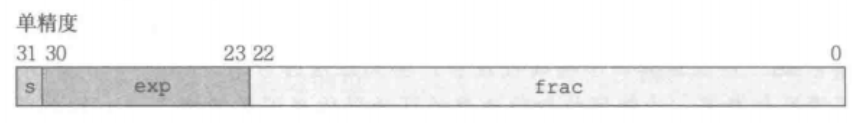
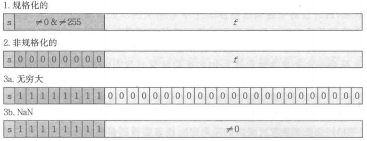

## 摘要

本文整理了 CSAPP Data Lab 的 12 道典型题目，涵盖异或、补码边界值、位模式判断、条件选择、逻辑非以及浮点数位级表示转换等内容。每题包含题目要求、代码答案与简要思路说明，适合作为 Data Lab 的复习笔记与查阅材料。

## Task 1

用 `~` 与 `&` 表示 Xor

```cpp
/* 
 * bitXor - x^y using only ~ and & 
 *   Example: bitXor(4, 5) = 1
 *   Legal ops: ~ &
 *   Max ops: 14
 *   Rating: 1
 */
int bitXor(int x, int y) {
  /**/
  return 2;
}
```

### Answer

```cpp
int bitXor(int x, int y) {
  return ~(~(~x & y) & ~(~y & x));
}
```

### Notes

异或运算（XOR）的核心特征在于：当两个操作数对应比特位上的状态互异时，该位结果为 1；若状态相同，则为 0。

基于题目限定只能使用 `~` 与 `&`，可以先构造两部分：

- `~x & y`：提取 `x = 0, y = 1` 的位
- `x & ~y`：提取 `x = 1, y = 0` 的位

原始异或表达式可写成：

`(~x & y) | (x & ~y)`

再利用德摩根定律把 `|` 改写为 `~` 和 `&`，即可得到最终结果。

## Task 2

使用给定的基本位运算符与逻辑运算符表示 `Tmin`

```cpp
/* 
 * tmin - return minimum two's complement integer 
 *   Legal ops: ! ~ & ^ | + << >>
 *   Max ops: 4
 *   Rating: 1
 */
int tmin(void) {
  return 2;
}
```

### Answer

```cpp
int tmin(void) {
  return 1 << 31;
}
```

### Notes

32 位整数补码的最小值位模式为 `1000...000`，即十六进制 `0x80000000`。因此只需将 `1` 左移 31 位即可。

## Task 3

使用给定的基本位运算符与逻辑运算符判断输入数据是否是最大有符号数

```cpp
/*
 * isTmax - returns 1 if x is the maximum, two's complement number,
 *     and 0 otherwise 
 *   Legal ops: ! ~ & ^ | +
 *   Max ops: 10
 *   Rating: 1
 */
int isTmax(int x) {
  return 2;
}
```

### Answer

```cpp
int isTmax(int x) {
  int y = x + 1;
  return !((y ^ ~x) | !y);
}
```

### Notes

对于补码最大值 `Tmax`，有 `Tmax + 1 = Tmin`，同时满足 `y = x + 1` 与 `y == ~x`。但 `-1` 也满足这一关系，所以要额外排除 `y == 0` 的情况。

## Task 4

```cpp
/* 
 * allOddBits - return 1 if all odd-numbered bits in word set to 1
 *   where bits are numbered from 0 (least significant) to 31 (most significant)
 *   Examples allOddBits(0xFFFFFFFD) = 0, allOddBits(0xAAAAAAAA) = 1
 *   Legal ops: ! ~ & ^ | + << >>
 *   Max ops: 12
 *   Rating: 2
 */
int allOddBits(int x) {
  return 2;
}
```

### Answer

```cpp
int allOddBits(int x) {
  int mask1 = 0xAA;
  int mask2 = (mask1 << 8) | mask1;
  int mask = (mask2 << 16) | mask2;
  return !((x & mask) ^ mask);
}
```

### Notes

构造出奇数位全为 1 的掩码 `0xAAAAAAAA`，再判断 `(x & mask)` 是否仍等于 `mask` 即可。

## Task 5

```cpp
/* 
 * negate - return -x 
 *   Example: negate(1) = -1.
 *   Legal ops: ! ~ & ^ | + << >>
 *   Max ops: 5
 *   Rating: 2
 */
int negate(int x) {
  return 2;
}
```

### Answer

```cpp
int negate(int x) {
  return ~x + 1;
}
```

## Task 6

```cpp
/* 
 * isAsciiDigit - return 1 if 0x30 <= x <= 0x39 (ASCII codes for characters '0' to '9')
 *   Example: isAsciiDigit(0x35) = 1.
 *            isAsciiDigit(0x3a) = 0.
 *            isAsciiDigit(0x05) = 0.
 *   Legal ops: ! ~ & ^ | + << >>
 *   Max ops: 15
 *   Rating: 3
 */
int isAsciiDigit(int x) {
  return 2;
}
```

### Answer

```cpp
int isAsciiDigit(int x) {
  return !((x >> 4 ^ 0x3) | (x >> 3 & (x >> 2 | x >> 1) & 1));
}
```

### Notes

思路是从反面排除：

1. 高 4 位必须等于 `0x3`
2. 低 4 位必须落在 `0x0` 到 `0x9`

第二点可以转化为排除 `0xA` 到 `0xF` 这一组位模式。

## Task 7

```cpp
/* 
 * conditional - same as x ? y : z 
 *   Example: conditional(2,4,5) = 4
 *   Legal ops: ! ~ & ^ | + << >>
 *   Max ops: 16
 *   Rating: 3
 */
int conditional(int x, int y, int z) {
  return 2;
}
```

### Answer

```cpp
int conditional(int x, int y, int z) {
  int mask = (x | (~x + 1)) >> 31;
  return (mask & y) | (~mask & z);
}
```

### Notes

利用 `x` 与 `-x` 的符号特征构造掩码：当 `x != 0` 时生成全 1 掩码，否则生成全 0 掩码，再分别选择 `y` 或 `z`。

## Task 8

```cpp
/* 
 * logicalNeg - implement the ! operator, using all of 
 *              the legal operators except !
 *   Examples: logicalNeg(3) = 0, logicalNeg(0) = 1
 *   Legal ops: ~ & ^ | + << >>
 *   Max ops: 12
 *   Rating: 4 
 */
int logicalNeg(int x) {
  return 2;
}
```

### Answer

```cpp
int logicalNeg(int x) {
  return ((x | (~x + 1)) >> 31 & 1) ^ 1;
}
```

### Notes

只有 `0` 与其相反数仍为 `0`，其余数值在 `x` 与 `-x` 中至少有一个会带最高位 1，据此可以构造逻辑非。

## Task 9

```cpp
/* howManyBits - return the minimum number of bits required to represent x in
 *             two's complement
 *  Examples: howManyBits(12) = 5
 *            howManyBits(298) = 10
 *            howManyBits(-5) = 4
 *            howManyBits(0)  = 1
 *            howManyBits(-1) = 1
 *            howManyBits(0x80000000) = 32
 *  Legal ops: ! ~ & ^ | + << >>
 *  Max ops: 90
 *  Rating: 4
 */
int howManyBits(int x) {
  return 0;
}
```

### Answer

```cpp
int howManyBits(int x) {
  int b16, b8, b4, b2, b1, b0;
  int sign = x >> 31;

  x = x ^ sign;

  b16 = !!(x >> 16) << 4;
  x = x >> b16;

  b8 = !!(x >> 8) << 3;
  x = x >> b8;

  b4 = !!(x >> 4) << 2;
  x = x >> b4;

  b2 = !!(x >> 2) << 1;
  x = x >> b2;

  b1 = !!(x >> 1);
  x = x >> b1;

  b0 = x;

  return b16 + b8 + b4 + b2 + b1 + b0 + 1;
}
```

### Notes

对负数先转化为统一的“找最高有效位”问题，再用二分方式查找最高位 1 的位置，最后补上符号位。

## Task 10

```cpp
/* 
 * floatScale2 - Return bit-level equivalent of expression 2*f for
 *   floating point argument f.
 *   Both the argument and result are passed as unsigned int's, but
 *   they are to be interpreted as the bit-level representation of
 *   single-precision floating point values.
 *   When argument is NaN, return argument
 *   Legal ops: Any integer/unsigned operations incl. ||, &&. also if, while
 *   Max ops: 30
 *   Rating: 4
 */
unsigned floatScale2(unsigned uf) {
  return 2;
}
```

### Answer

```cpp
unsigned floatScale2(unsigned uf) {
  unsigned sign = uf & 0x80000000;
  unsigned exp = (uf >> 23) & 0xFF;
  unsigned frac = uf & 0x7FFFFF;

  if (exp == 0xFF) {
    return uf;
  }

  if (exp == 0) {
    return (uf << 1) | sign;
  }

  exp++;
  if (exp == 0xFF) {
    return sign | 0x7F800000;
  }

  return sign | (exp << 23) | frac;
}
```

### Notes

关键在于区分三类情况：

- `exp == 0xFF`：NaN 或无穷，原样返回
- `exp == 0`：非规格化数，整体左移
- 其他：规格化数，只需指数加 1





## Task 11

```cpp
/* 
 * floatFloat2Int - Return bit-level equivalent of expression (int) f
 *   for floating point argument f.
 *   Argument is passed as unsigned int, but
 *   it is to be interpreted as the bit-level representation of a
 *   single-precision floating point value.
 *   Anything out of range (including NaN and infinity) should return
 *   0x80000000u.
 *   Legal ops: Any integer/unsigned operations incl. ||, &&. also if, while
 *   Max ops: 30
 *   Rating: 4
 */
int floatFloat2Int(unsigned uf) {
  return 2;
}
```

### Answer

```cpp
int floatFloat2Int(unsigned uf) {
  int sign = uf >> 31;
  int exp = (uf >> 23) & 0xFF;
  int frac = uf & 0x7FFFFF;

  int E = exp - 127;
  int M = frac | (1 << 23);

  if (E < 0) {
    return 0;
  } else if (E >= 31) {
    return 0x80000000u;
  }

  if (E > 23) {
    M = M << (E - 23);
  } else {
    M = M >> (23 - E);
  }

  if (sign) {
    return ~M + 1;
  }

  return M;
}
```

## Task 12

```cpp
/* 
 * floatPower2 - Return bit-level equivalent of the expression 2.0^x
 *   (2.0 raised to the power x) for any 32-bit integer x.
 *
 *   The unsigned value that is returned should have the identical bit
 *   representation as the single-precision floating-point number 2.0^x.
 *   If the result is too small to be represented as a denorm, return
 *   0. If too large, return +INF.
 * 
 *   Legal ops: Any integer/unsigned operations incl. ||, &&. Also if, while 
 *   Max ops: 30 
 *   Rating: 4
 */
unsigned floatPower2(int x) {
  return 2;
}
```

### Answer

```cpp
unsigned floatPower2(int x) {
  if (x > 127) {
    return 0x7F800000;
  } else if (x >= -126) {
    int exp = x + 127;
    return exp << 23;
  } else if (x >= -149) {
    return 1 << (x + 149);
  } else {
    return 0;
  }
}
```

## 总结

Data Lab 的核心不在于死记答案，而在于熟悉补码、位模式与布尔代数之间的等价变换。只要把题目要求转回到位级表示，再利用题目允许的操作符逐步改写，大多数题都能得到比较自然的解法。
