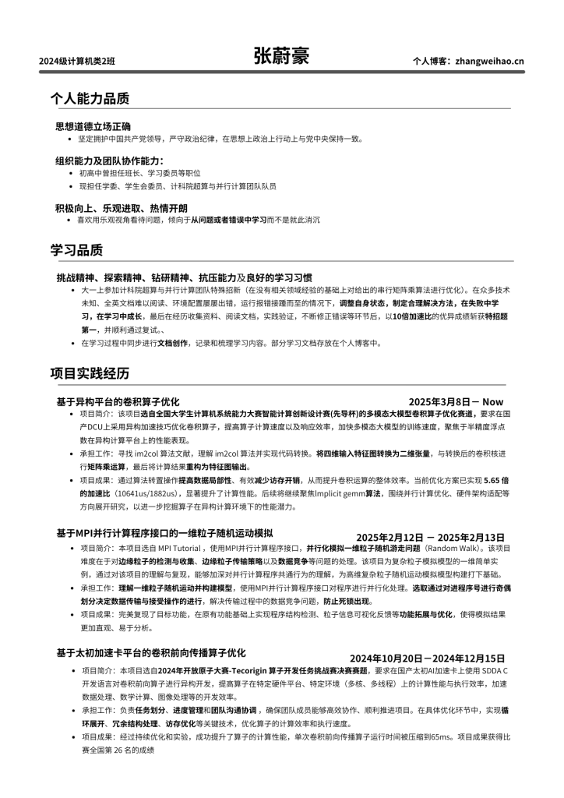
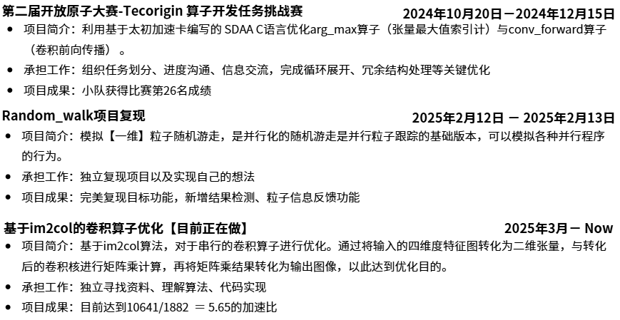
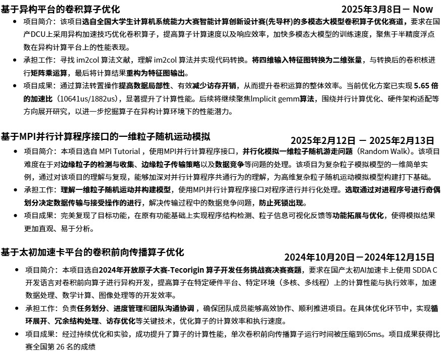

## 摘要

本文记录了作者人生第一份简历的创作全过程，包括简历设计思路、面试自我介绍准备、面试经验总结以及简历创作技巧。从确定目标人群、构建大纲到内容包装、项目书写要点，完整分享了一份优秀简历的诞生过程，同时附带了真实的面试经验和反思，对于准备简历和面试的同学具有很好的参考价值。

---

# 前言

为了准备学院创新拔尖班而准备的个人简历与面试自我介绍。简历与自我介绍一共耗时8-10小时，其中简历创作感谢团队学长们的不吝指导。下面是2025年春 个人简历暨人生第一份简历与面试自我介绍。

---

> 于等待面试的小紧张中作此 passage。
后面会补充简历、自我介绍文段创作以及面试要点。

# 个人简历

END VERSION

# 面试自我介绍

面试老师你们好，很荣幸能够参加此次创新班选拔面试，也很感激学院提供的这样一次机会。

我是学院2024级计算机类二班学生张蔚豪，现担任学生会委员，班级学习委员以及超算与并行计算团队24级队员，因此具有一定的团队协作能力以及组织规划能力。

同时我还具有良好学习习惯。曾在高考结束后的暑假自学C语言程序设计、高等数学等内容。在大一上参加超算与并行计算团队特殊招新，自学矩阵乘以及并行程序设计导论，斩获特招题第一名，顺利通过复试成为团队成员。

除此之外，我还具有钻研精神，挑战精神以及不错的抗压能力。

在我眼中，创新班是一个具有更多资源倾斜的，能够让有能力的人大放光彩的舞台，成为创新班成员，要自觉承担科研竞赛为学院争光的责任。

而对于我而言，我自幼便对科研竞赛抱有浓厚兴趣，喜欢探索未知领域，专研解决难题，认为在科研竞赛种获得成果是自我价值的一种体现，因此希望进入创新班。

相对于其他人而言，我具有半年的竞赛经历，掌握部分科研竞赛能力，能够较好衔接学院的科研竞赛安排。

如果能够有幸进入班级，我将会继续努力，早日在科研竞赛中产出结果，不负老师及学院的期待。

## Quick Summary

自我介绍最终要的也是**贴近面试方的需求**，根据需求指定表现内容。

同下文项目实践 Part 的书写，也大致分为一下几个阶段：

- 确定需求

- 指定大纲

- 丰富内容

- 修改表达

- 润色文字

具体内容同下，因此便不过多解释

# 面后感言

4.45开始面试，4.50结束面试

面试过程没有想象中那样剑拔弩张的气氛，面试老师都挺亲和，不过并不是所有 老师都在认真看简历以及提问（也许是前面面试的时间太长了，老师觉得有些枯燥，再加上我的简历没有什么亮点...）

其中有两个老师在看简历以及提问：

其中一个老师根据我简历中的项目进行了技术提问：

- 解释一下第二个项目中提及的死锁问题？

另外一个老师则是对于绩点、英语成绩等学习相关的方面进行了提问：

- 绩点是多少？

- 英语成绩如何？

前者还问了一下了我的**比赛经历**，后者对我的**简历编排表示肯定**。（说是到目前为止看到的做得最好的一份）

面试自我介绍的时候还是难免会有紧张。还是以前对外 express 少了，后面得多加锻炼。

## Quick Rethink

面试的话肯定会对项目内容进行技术提问，因此要在面试前回顾项目，做好被拷打的准备

面试时被拷打技术可能会有些紧张而不知道如何描述，此时便可以使用模糊化表述的方法，说出技术重点，表现“知道技术要点但是由于紧张难以表达”。

例如，面试时对于“死锁”问题，我给出的解释是：MPI是一个**多线程并行计算**的一个编程模式，由于其**分布式内存的特点**，其处理的**数据需要进行接受与传递**，而如果对于进程间数据接受与发送的**顺序没有进行妥善处理**，就会出现**线程持续等待数据接受**，出现死锁问题...

诚然，这不是一个标准的答案，当我回答完后甚至可以马上补充几点，但是这确实是在紧张情况下能做出的较好的回答了 -- 解释问题发生环境、发生过程原因以及发生关键点。这让面试官知道尽管你没有回答完美，但是你对这个技术具有一个清晰的认知。

可能是因为这个原因，我幸运 pass 掉了这个问题

> 比较不错的解释：
死锁是指**多个进程在执行过程中**，因**资源争夺**而造成的一种**互相等待**的状态，若无外力作用，这些进程都将无法向前推进。在 MPI 中通常是由于进程之间的通信操作没有正确安排，导致相互等待对方完成某些操作，从而陷入无限期的阻塞。
例如**进程 A 先执行发送操作，期望进程 B 接收后再进行下一步；但进程 B 却先执行了另一个接收操作，等待其他进程发送，而不是等待进程 A 的发送，这就导致两个进程互相等待，形成死锁。**
死锁是MPI编程中常常出现的一个问题，**可以通过合理安排线程通信顺序解决，例如常见的对进程编号进行奇偶划分，交替执行数据接收以及传输行为**。

# 简历创作总结

## 确定目标人群：

面试的是中年导师，是具有很强技术能力的前辈，通常这些人喜欢简洁干净的呈现方式。

（因为他们日常处理的杂事较多，为了提高工作效率，会倾向于简洁、干净、一目了然获得信息的呈现方式）

## 确定适用背景：

因为是作用于**学院创新拔尖班级的选拔**，需要照顾学院上的一些要求。

（按照学院文件选拔要求，需要政治思想相关内容、学习相关品质、科研相关品质等模块）

> 通过上面的分析就可以大致构建出简历的基本雏形。而接下来就需要构思大纲，搭好简历框架。

## 作出大纲

按照前面的分析，划分出：

个人能力品质、学习品质、项目时间经历 -- 分别对应思想道德、学习能力、科研品质模块。

再结合实践经历作出各个模块对应下的内容：

## 包装内容【非常重要】

> 题外话：中华文化博大精深，其中以汉语言文字为最。一个意思，通过汉语能够有多种表达方式，而每一种表达方式，都能给人带来截然不同的感官体验。马靠鞍装，人靠衣装，而简历则靠文字修饰。在简历创作中，对语言文字的斟酌以及部分内容的修饰额外重要。

说人话就是：

**通过对语言进行修饰，最大程度展示自己的技术水平，提高面试官对自己的技术信任度**

例如：

### 修改润色之前：

### 修改润色后：

很明显，润色后的文章看上去高级很多，会让阅读者感受到你的专业水平，产生信任感。并且修改后的项目层次清晰，能够清晰反馈出在项目中所做贡献以及成效。

> 注意！所有的文章润色都**必须基于一定的事实依据**，**不能为了润色而去虚构内容**，真诚永远是最可贵的品质之一，不要因小失大。

那么，项目书写的重点是什么？怎么才能实现锦上添花的成效？

## 项目内容书写要点

### 标题部分

标题要在展示项目内容的同时看上去高级一点，这里推荐使用以下两种方法：

- 套用：基于XXX（平台/技术）的XXX（项目内容）实现

- 从网上淘一些高级简历，再将其与自己项目主要信息一起喂给 AI 让其进行模板迁移

### 内容部分

为了显得项目比较正式，推荐分为以下三个部分

- 项目内容

- 承担工作

- 项目成果

并且每个部分在简历上占据2-3行内容，这样会体现项目的可书写性（就很厉害的样子）较强

> 注意！要区分每个模块对应的内容，不要随意安排内容，会显得混乱不堪，反而是扣分项【本人简历前期版本就犯了这样的错误】

### 项目编排部分

一般而言项目按照时间顺序：近期 --> 远期的时间顺序进行编排

> 因为老师喜欢拷打你最近所做项目内容，能从中得到你的技术能力和学习能力的反馈

## 整体内容编排

尽量做到每段文字都比较丰实，尽量不要出现一个 part 中各块内容相差很大，参差排布的现象。会显得排版混乱。

# END

做完这些细节处理，你的简历一定会达到一个不错的水平，相信它一定会获得面试官的青睐。

接下来，就放开身心，自信面对接下来的面试吧！

