## 摘要

SGEMM（Single-precision General Matrix-matrix Multiply）作为基础线性代数子程序（BLAS）库中的核心函数，执行的核心运算是$ C=α⋅op(A)⋅op(B)+β⋅C$，在高性能计算领域扮演着关键角色，为科学计算、工程模拟乃至深度学习等前沿应用提供基础算力支撑。特别是在深度学习中，神经网络的训练与推理涉及大量的卷积及全连接层运算，这些运算的核心部分能够被高效地重构为SGEMM问题，从而调用高度优化的函数库在硬件上实现加速。由于SGEMM是典型的计算密集型（compute-intensive）任务，其在硬件（尤其是GPU）上的优化效率直接决定了上层应用的性能上限，是整个计算流程中的优化要点。本文采用合并内存访问、共享内存分块、向量化、寄存器优化、双缓冲等技术在PTX4090上对单精度算子进行优化，优化后的算子整体性能达到cublas的80%左右，最高可达97.5%。

# 1. 基础测评

首先，基于 polybench 编写 native kernel 以及 cublas kernel 并分别在不同数据集下批量运行，获得性能曲线，如图1.1所示

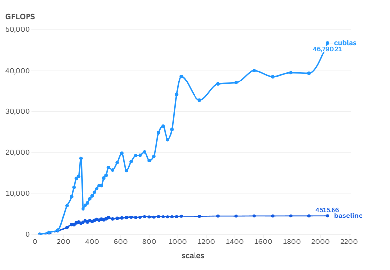

<center>图1.1</center>

可以直观看到，cublas 的 GFLOPS 为 baseline 的十倍左右，具有极大的优化空间

下面对于native kernel 不理想性能原因进行分析

# 2. 理论分析

## 2.1 bound 定位

设置优化的基准矩阵大小为 1024*1024*1024（M*N*K)，则根据硬件指标以及计算可以获得以下数据：

TheoreticalFLOPs = 2×NI×NJ×NK = 2*1024*1024*1024 = 2.147GFLOPs

TheoreticalFLOPS_Peak = 82.58 TFLOPS

TheoreticalComputeTime = TheoreticalFLOPs / TheoreticalFLOPS = 2.147 / 82,580 = **25.99 × 10 µs**

TheoreticalBytes（min）=((NI×NK)+(NK×NJ)+2×(NI×NJ))×sizeof(DATA_TYPE) = 3*1024*1024*4 = 12,582,912 byte = 12.58 Mb

TheoreticalBandwidth = 1.01 TB/s

**TheoreticalMemTime** = TheoreticalBytes / TheoreticalBandwidth = **11.9 × 10 µs**

> 可以看到，理论上这是一个compute bound kernel

## 2.2 native kernel 分析

#### native版本

根据ncu采样报告，我们可以获得如下指标：

RealTime = **484.67 us**

dram__bytes_read.sum = **12,585,728 byte**

Real_FLOPS = 4.437 TFLOPS

Real\_Bandwidth = **25.97 GB/s** （对应计算load_time= **470.5 µs**）

可以看到缓存所用时间占据了 RunTime 的绝大部分，native kernel 是 memory bound

> **memory_bound**

## 2.3 cublas kernel 分析

根据ncu采样报告，我们可以获得如下指标：

RealTime =  **54.98 us**

dram__bytes_read.sum = **12,585,728 byte**

Real_FLOPS = 39.11TFLOPS

Real\_Bandwidth = **228.88 GB/s** （对应计算load_time= **53.7 µs**）

> 对比可以看到，native kernel在带宽利用上面和cublas差距极大，后面的优化主要以此着手

# 3. 逐级优化策略及实验结果

## 3.1 coalesce read 合并内存访问

属于同一个 warp 的线程的顺序内存访问可以被分组并作为一个整体执行，这种访问方式被成为全局内存合并。

native kernel 直接使用下面的索引方式，不能确保warp内线程合并访问数据

```C++
const uint x = blockIdx.x * blockDim.x + threadIdx.x;
const uint y = blockIdx.y * blockDim.y + threadIdx.y;
```

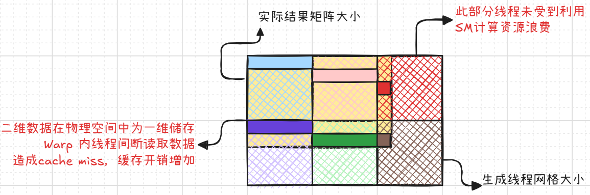

为了实现全局内存访问，修改了索引计算方式

```C++
const int x = blockIdx.x * BLOCKSIZE + (threadIdx.x / BLOCKSIZE);
const int y = blockIdx.y * BLOCKSIZE + (threadIdx.x % BLOCKSIZE);
```

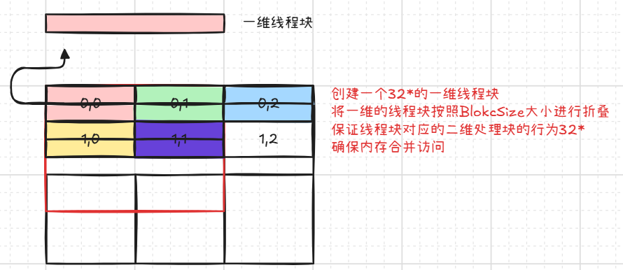

> 需要注意，此种划分方式必须要确保：
1. 线程块以一维方式启动
2. 线程块大小为32x

### 性能结果图

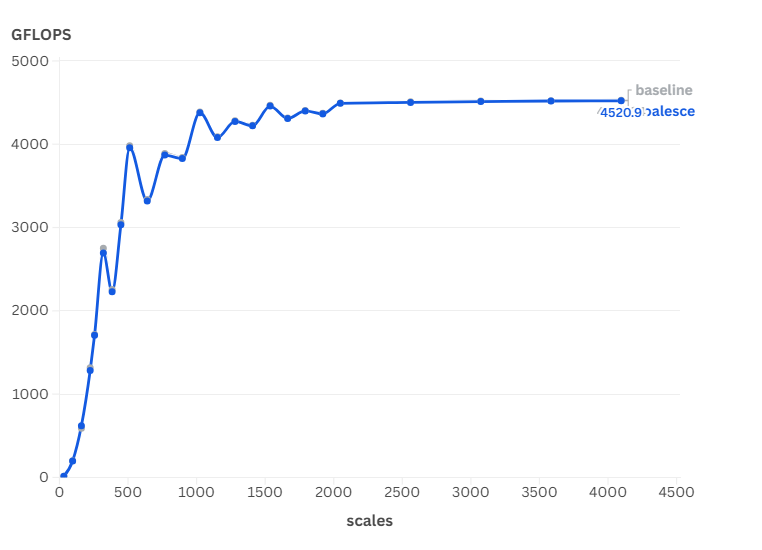

> 可能由于native kernel线程块启动为32*32且基准数据集大小为1024*1024，native版本已实现全局内存合并访问，因此目前没有得到明显的优化结果

### 相关性能指标：

Warp State 中 Stall LG Throttle 占比最大，为20.12 cycles

Stall LG Throttle：

> Warp was stalled waiting for the L1 instruction queue for local and global (LG) memory operations to be not full. Typically, this stall occurs only when executing local or global memory instructions extremely frequently. Avoid redundant global memory accesses. Try to avoid using thread-local memory by checking if dynamically indexed arrays are declared in local scope, or if the kernel has excessive register pressure causing spills. If applicable, consider combining multiple lower-width memory operations into fewer wider memory operations and try interleaving memory operations and math instructions.
Warp 因等待 L1 指令队列中局部和全局（LG）内存操作不处于满载状态而阻塞。通常，这种阻塞仅发生在执行局部或全局内存指令极其频繁时。**避免冗余的全局内存访问**。尝试通过检查是否在局部作用域中声明了动态索引数组，或内核是否存在过多的寄存器压力导致溢出，来避免使用线程局部内存。如果适用，**考虑将多个低宽度内存操作合并为较少的高宽度内存操作**，并尝试**交错内存操作和数学指令**。

## 3.2 SMEM 使用共享内存

GPU内存硬件除了Global Memory外还有cache line 2 、cache lline 1/Shared Memory以及Register。越靠后越接近计算单元，储存空间越小，读取速率越快

前面仅用到GMEM，下面准备利用SMEM

先从GMEM 中分别 load BLOCKSIZE*BLOCKSIZE 大小的A、B块，每个线程仍被分配C的一个元素进行计算。沿着 A 的列和 B 的行移动这些数据块，对 C 进行部分求和，直到获得完整计算结果。

示意图如下：

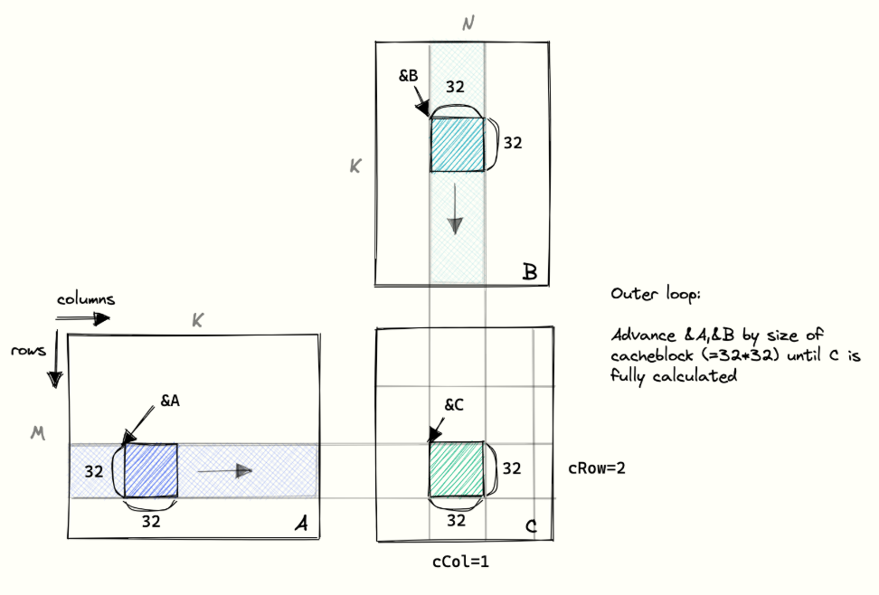

### 性能结果图

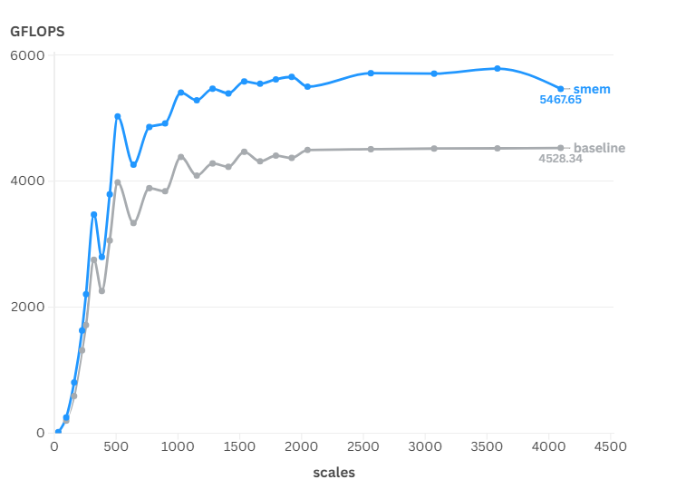

### 相关性能指标：

RealTime =  **406.05 µs**

dram\_\_bytes_read.sum = **12,583,680 byte**

Real\_FLOPS = 5.296 TFLOPS

Real\_Bandwidth = **30.99 GB/s** （对应计算load_time= **396.4 µs**）

> 依旧是 memory bound

Warp State 中 Stall LG Throttle 占比由20.12减少至0.39cycles

Stall MIO Throttle 占比最大，达到 23.95 cycles

Stall MIO Throttle：

> Warp was stalled waiting for the MIO (memory input/output) instruction queue to be not full. This stall reason is high in cases of extreme utilization of the MIO pipelines, which include special math instructions, dynamic branches, as well as shared memory instructions. When caused by shared memory accesses, trying to use fewer but wider loads can reduce pipeline pressure.Warp 
因等待 MIO（内存输入/输出）指令队列不空而阻塞。这种阻塞原因在使用 MIO 管道极端情况下较为常见，包括特殊数学指令、动态分支以及共享内存指令。当由共享内存访问引起时，尝试使用**更少但更宽的加载**可以减少管道压力。

问题出现在 GMEM → SMEM这个阶段，这里有几种处理方式，一种是双缓冲，一种是增加数据load后面的计算部分，两者都是掩盖延迟，另外还有的是用向量读取，增大带宽利用率。下面以增加数据计算量为例继续优化

## 3.3 Blocktiling 分块优化

RTX 4090 SMEM 大小为128KB（2^17Byte)

一个64*64的float矩阵占32KB（2^14Byte），一个SMEM能容纳2个128*128矩阵，而我们上次的优化仅使用了2*32*32的SMEM，因此我们不难想到可以让SMEM储存和处理更多的数据

但是，ThreadBlock维度一般是32*32大小，64*64/128*128容易降低SM利用率

load 64*64?128*128的数据意味一个线程需要处理多个（这里是2*2/4*4）数据，接下来过渡到线程分块方法

> 过程示意图：

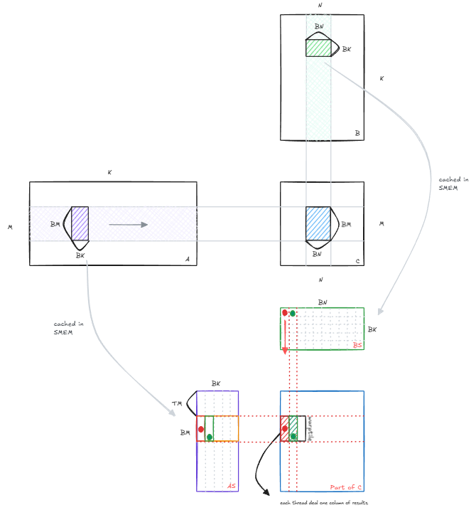

### 性能结果图

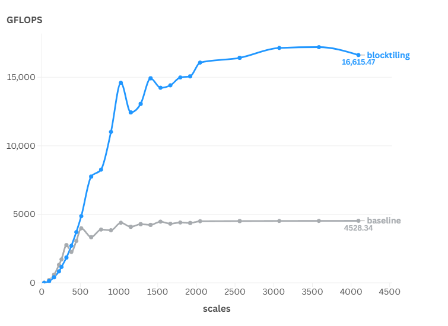

### 线程内存访问次数计算

#### SMEM

每个线程计算一个结果

GMEM: K/32 iterations of outer loop * 2 loads

SMEM: K/32 iterations of outer loop * BLOCKSIZE (=32) * 2 loads

Memory accesses per result: K/16 GMEM, K*2 SMEM

#### Blocktiling-1d

每个线程计算8个结果

GMEM: K/8 iterations of outer loop * 2 loads

SMEM: K/8 iterations of outer loop * BK(=8) * (1 + TM(=8))

Memory accesses per result: K/32 GMEM, K*9/8 SMEM

### 相关性能指标：

RealTime =  **149.28 µs**

dram\_\_bytes_read.sum = **12,583,552 byte**

Real\_FLOPS = 14.406 TFLOPS

Real\_Bandwidth = **84.29 GB/s** （对应计算load_time= **145.7 µs**）

> 依旧是 memory bound

> 和预期的一样，每条指令由于内存停顿的周期数目大大减小

Warp Stall指标均显著减少（下面展示前三stall）

Warp State /All Cycles)

Stall MIO Throttle 6.31

Stall Long Scoreboard 5.52

Stall Barrier 2.74

## 3.4 Blocktiling-2d 分块

这个和Blocktiling-1d分块思路一致，不过为了更好地去扩大线程处理的数据，将线程块转为二维进行处理，一个线程计算 8*8 个矩阵元素

示意图如下

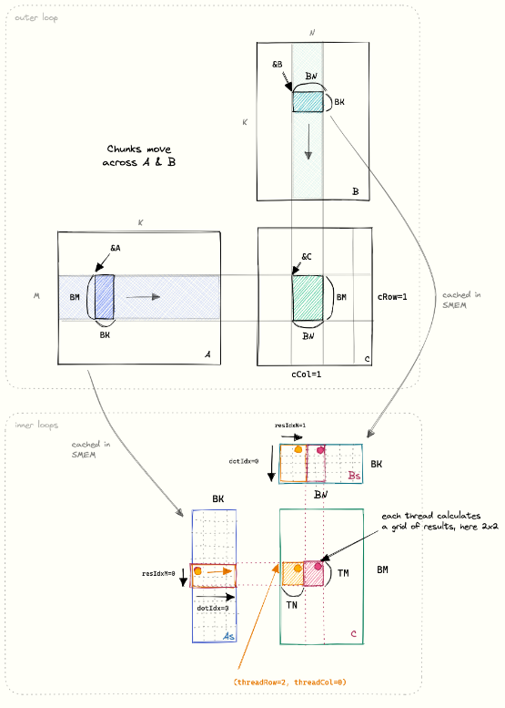

### 代码关键部分

```C++
// define the result register
float threadResults[TM * TN] = {0.0};
// register for As、Bs
float regM[TM] = {0.0};
float regN[TN] = {0.0};


    for(int BlockIdx = 0; BlockIdx < K ; BlockIdx += BK) {  
      // As[innerRowA * BK + innerColA] = A[innerRowA * K + innerColA];
      // Bs[innerRowB * BN + innerColB] = B[innerRowB * N + innerColB];
      // load data
      for (uint loadOffset = 0; loadOffset < BM; loadOffset += strideA) {
        As[(innerRowA + loadOffset) * BK + innerColA] =
        A[(innerRowA + loadOffset) * K + innerColA];
      }
      for (uint loadOffset = 0; loadOffset < BK; loadOffset += strideB) {
        Bs[(innerRowB + loadOffset) * BN + innerColB] =
            B[(innerRowB + loadOffset) * N + innerColB];
      }
      // block threads in this block until cache is fully populated
      __syncthreads();

      A += BK;
      B += BK * N;

      // dot product
      for (int dotIdx = 0; dotIdx < BK; ++dotIdx) {
        for (uint i = 0; i < TM; ++i) {
          regM[i] = As[(threadRow * TM + i) * BK + dotIdx];
        }
        for (uint i = 0; i < TN; ++i) {
          regN[i] = Bs[dotIdx * BN + threadCol * TN + i];
        }
        for (uint resIdxM = 0; resIdxM < TM; ++resIdxM) {
          for (uint resIdxN = 0; resIdxN < TN; ++resIdxN) {
            threadResults[resIdxM * TN + resIdxN] +=
                regM[resIdxM] * regN[resIdxN];
          }
        }
      }
      __syncthreads();
    }
    
    for (uint resIdxM = 0; resIdxM < TM; ++resIdxM) {
      for (uint resIdxN = 0; resIdxN < TN; ++resIdxN) {
        C[(threadRow * TM + resIdxM) * N + threadCol * TN + resIdxN] =
            alpha * threadResults[resIdxM * TN + resIdxN] +
            beta * C[(threadRow * TM + resIdxM) * N + threadCol * TN + resIdxN];
      }
    }
```

### 性能结果图

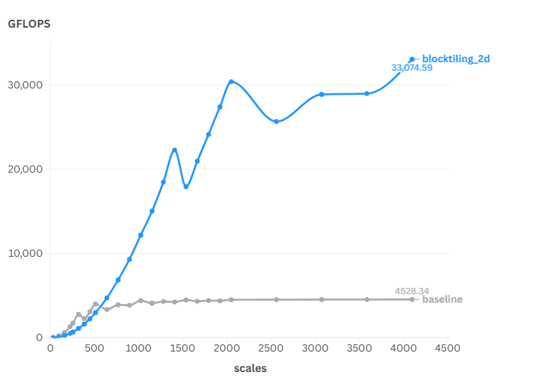

### 线程内存访问次数计算

#### Blocktiling-1d

每个线程计算8个结果

GMEM: K/8 iterations of outer loop * 2 loads

SMEM: K/8 iterations of outer loop * BK(=8) * (1 + TM(=8))

Memory accesses per result: K/32 GMEM, K*9/8 SMEM

#### Blocktiling-2d

每个线程计算8*8个结果

GMEM: K/8 (outer loop iters) * 2 (A+B) * 1024/256

SMEM: K/8 (outer loop iters) * 8 (dotIdx) * 2 (A+B) * 8 loads

Memory accesses per result: K/64 GMEM, K/4 SMEM

### 相关性能指标：

RealTime =  175.23 **µs**

dram\_\_bytes_read.sum = **12,583,808 byte**

Real\_FLOPS =  12.273 TFLOPS

Real\_Bandwidth = **71.81 GB/s** （对应计算load_time= **145.7 µs**）

> 这里由于数据集过小，延迟掩盖效果过低，所以运行时间比Blocktiling-1d要慢，FLOPS也要低

> 1024规模后的数据集测试，2d分块FLOPS明显大于1d分块

Warp Stall指标均显著减少

## 3.5 Vectorize 向量化 + 转置写入 + 寄存器

通过向量化操作对内存访问进行优化，将原有的 4 次 float 类型加载指令整合为 1 次 float4 类型（128 位）加载操作。在保持数据总量不变的前提下，显著减少内存装载指令的调用次数，从而提升内存带宽的利用效率。

针对涉及内存读写的模块，均采用 float4 类型进行向量化处理，通过单次 128 位数据传输替代多次 32 位数据传输，可有效提高内存访问吞吐量，充分发挥硬件的向量计算能力。

在向量读取数据的时候对A矩阵进行转置操作，方便后面的点积操作

在点积循环中使用寄存器，增加数据读取和复用效率

### 代码关键部分

```C++
    // main compute part
    for(int BlockIdx = 0; BlockIdx < K ; BlockIdx += BK) {  
      float4 tmp = reinterpret_cast<float4 *>(&A[innerRowA * K + innerColA * 4])[0];
      // Transposed writing for dotting product.
      As[(innerColA * 4 + 0) * BM + innerRowA] = tmp.x;
      As[(innerColA * 4 + 1) * BM + innerRowA] = tmp.y;
      As[(innerColA * 4 + 2) * BM + innerRowA] = tmp.z;
      As[(innerColA * 4 + 3) * BM + innerRowA] = tmp.w;

      reinterpret_cast<float4 *>(&Bs[innerRowB * BN + innerColB * 4])[0] =
          reinterpret_cast<float4 *>(&B[innerRowB * N + innerColB * 4])[0];
      __syncthreads();

      A += BK;
      B += BK * N;

      for (int dotIdx = 0; dotIdx < BK; ++dotIdx) {
        for (uint i = 0; i < TM; ++i) {
          // regM[i] = As[(threadRow * TM + i) * BK + dotIdx];
          regM[i] = As[dotIdx * BM + threadRow * TM + i];
        }
        for (uint i = 0; i < TN; ++i) {
          regN[i] = Bs[dotIdx * BN + threadCol * TN + i];
        }

        for (uint resIdxM = 0; resIdxM < TM; ++resIdxM) {
          for (uint resIdxN = 0; resIdxN < TN; ++resIdxN) {
            threadResults[resIdxM * TN + resIdxN] +=
                regM[resIdxM] * regN[resIdxN];
          }
        }
      }
      __syncthreads();
    }

    for (uint resIdxM = 0; resIdxM < TM; resIdxM += 1) {
      for (uint resIdxN = 0; resIdxN < TN; resIdxN += 4) {
        // load C vector into registers
        float4 tmp = reinterpret_cast<float4 *>(
            &C[(threadRow * TM + resIdxM) * N + threadCol * TN + resIdxN])[0];
        // perform GEMM update in reg
        tmp.x = alpha * threadResults[resIdxM * TN + resIdxN] + beta * tmp.x;
        tmp.y = alpha * threadResults[resIdxM * TN + resIdxN + 1] + beta * tmp.y;
        tmp.z = alpha * threadResults[resIdxM * TN + resIdxN + 2] + beta * tmp.z;
        tmp.w = alpha * threadResults[resIdxM * TN + resIdxN + 3] + beta * tmp.w;
        // write back
        reinterpret_cast<float4 *>(
            &C[(threadRow * TM + resIdxM) * N + threadCol * TN + resIdxN])[0] =
            tmp;
      }
    }
```

### 性能结果图

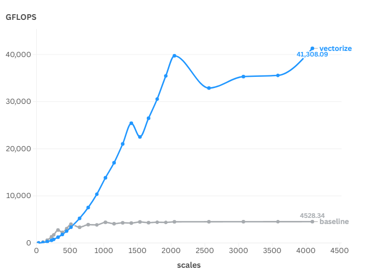

### 相关性能指标：

RealTime = **156.03 µs**

dram\_\_bytes_read.sum = **12,583,552 byte**

Real\_FLOPS =  13.783 TFLOPS

Real\_Bandwidth = **80.65 GB/s** （对应计算load_time= **152.3 µs**）

## 3.6 Buffering 双缓冲 + WarpTile

从上面的分析可以看出，目前数据的访存开销依旧是kernel开销的主体

在上一个版本的代码中，我们使用了两次 `__syncthreads()` 来做线程同步，以防止不同线程之间的数据不一致。其中第一个 `__syncthreads()` 是为了保证读后写（Read-After-Write）的顺序性，这个是无法避免的。

但是对于后一个同步，目的是为了防止数据在处理完之前被其它线程读取，保证写后读（Write-After-Read）的顺序性。

这两个同步出现的本质，是因为我们在不同迭代中使用了同一块空间来保存我们所需的数据，这两次迭代中的数据之间并不存在真正的依赖关系。如果我们将其写入到其他地址上，那么就不需要使用同步了。

这种方式就成为数据预取，也叫做双缓冲。我们可以申请两倍的储存空间，每次迭代交替使用，省去最后一步同步操作，同时掩盖延迟

> 示意图如下

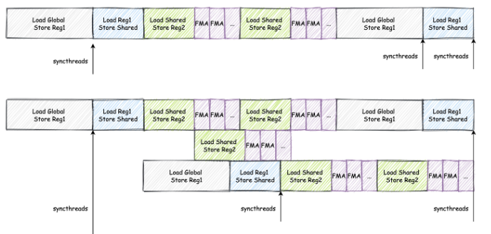

### 代码关键部分

```C++
// 申请双倍空间
__shared__ float smem_a[2][BM * BK];
__shared__ float smem_b[2][BK * BN];

int write_index = 0;

// 外层循环遍历矩阵块
for (uint bk_idx = 0; bk_idx < K; bk_idx += BK)
{
    // 读取数据到共享内存 smem_a[write_index] 和 smem_b[write_index]
    ...
    __syncthreads();

    // 计算
    // 加载数据到寄存器 reg_a[write_index] 和 reg_b[write_index]
    ...

    A += BK;
    B += BK * N;

    // 撤销原来的同步
    ...

    write_index = 1 - write_index; // 切换读写指针
}
```

### 性能结果图

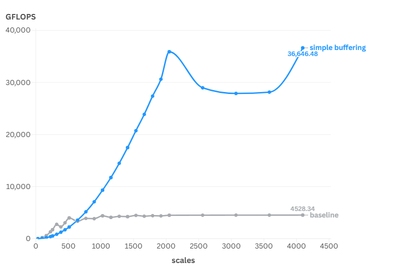

> 这令人感到奇怪，双缓冲之后FLOPS反而下降了
猜测这可能和我使用了Warp分块有关，加载的数据过多，SM利用率下降，延迟掩藏效果减小
后面打算单独测试一个native-double-buffering的版本来进行思路验证

## 3.7 Buffering_no_WarpTile 双缓冲

去掉Warp维度的分块部分，空出多余寄存器空间，增加SM占用率，测试性能得到一定提升

### 代码关键部分

```C++
    __shared__ float As[2][BM * BK];
    __shared__ float Bs[2][BK * BN];

    // 索引计算部分
    ...

    float regM[2][TM] = {0.0};
    float regN[2][TN] = {0.0};

    int write_idx = 0;

    // 先进行数据搬运到 As[0][]
    float4 tmp = reinterpret_cast<float4 *>(&A[innerRowA * K + innerColA * 4])[0];
    ...

    // 对应位置偏移
    A += BK;
    B += BK * N;

    for(int BlockIdx = BK; BlockIdx < K ; BlockIdx += BK) {  
        // 计算部分
        ...

      // 数据区间变换
      write_idx ^= 1;

      // 数据读取
      float4 tmp = reinterpret_cast<float4 *>(&A[innerRowA * K + innerColA * 4])[0];
      ...

      A += BK;
      B += BK * N;
    }

    // 处理最后一份数据
    for (int dotIdx = 0; dotIdx < BK; ++dotIdx) {
        ...
    }

    // 写入数据
    for (uint resIdxM = 0; resIdxM < TM; resIdxM += 1) {
      for (uint resIdxN = 0; resIdxN < TN; resIdxN += 4) {
         ...
      }
    }
```

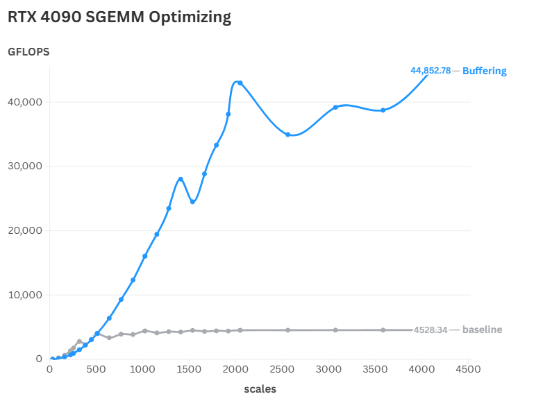

## 3.7 向量寄存器读取+bankconflict解决

当声明向量寄存器时，系统会自动分配相邻的寄存器空间为整个向量寄存器，因此可以采用向量寄存器对最终的点积计算部分进行数据的读取，增大带宽利用率。

由于Share Memory为了实现高并发访问，在物理上设计了32个独立访问的储存体（bank），多个线程对一个bank同时进行访问会引发bank conflict，将原来的并行数据访问退化到串行访问，极大减少带宽利用率。本次优化采用padding技术，填充4字节的额外空间，在保证向量化访问对齐要求的同时打乱有效数据的存储方式，减少bank conflict 发生。

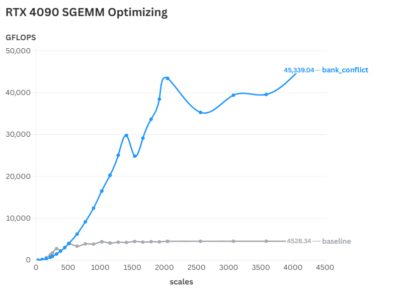

## 4. 优化总结

本次优化实验采用了共享内存、BlockTiling、向量化操作、双缓存、向量寄存器以及bank conflict技术对Sgemm算子进行优化，优化后的算子整体性能达到cublas的80%左右，最高可达97.5%，具体加速图如下所示。

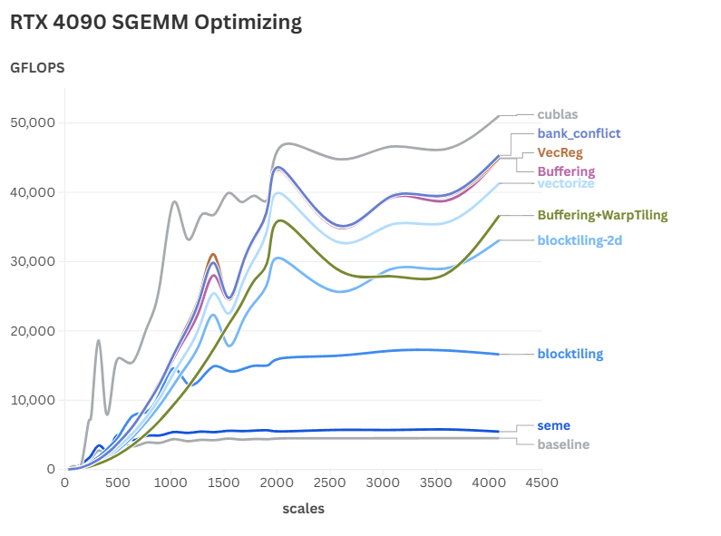

通过本次实验，我们得以深入探究NVIDIA GPU架构的核心原理与优化机制。在实践过程中，我们系统性地掌握了共享内存分块、向量化读取等关键技术，并有效解决了Bank Conflict问题。此外，实验使我们对CUDA算子优化的规范化流程建立了完整的认知框架，包括性能分析、瓶颈定位及优化策略实施等关键环节，为后续高性能计算开发奠定了坚实的理论与实践基础。

实验结果表明，尽管在个别测试样例中，本实验实现的算子性能已接近cublas库的水平，但整体运算效率仍存在显著差距。通过简要分析，这种性能差异主要可归因于以下三个关键因素，这也是未来实验需要重点改进的方向：

1. 分块策略优化不足：当前的实现采用了固定的分块大小，未能根据输入数据的规模进行动态调整，这可能导致访存模式不够理想，无法充分利用GPU的内存层次结构。

2. Tensor Core硬件未充分利用：在计算过程中，未能有效利用NVIDIA GPU的Tensor Core矩阵计算单元（Matrix Multiply-Accumulate, MMA），这使得计算密集型操作的性能未能达到硬件的最佳理论值。异步内存拷贝硬件资源利用率不足：在全局内存（GMEM）到共享内存（SMEM）的数据传输过程中，未能有效利用张量内存加速器（Tensor Memory Accelerator, TMA）硬件单元。这种非优化的数据传输模式不仅增加了寄存器资源的消耗，还造成了CUDA计算核心（CUDA core）的额外负载，从而降低了整体计算效率。

后续实验将重点针对上述问题展开深入探索，通过引入自适应分块策略和Tensor Core优化技术，进一步提升算子的整体性能。


## 附录

### RTX 4090 相关硬件指标


- L1 Cache

    128 KB (per SM) - 2^15个float


- L2 Cache

    72 MB

|**内存类型**|**容量**|**带宽**|**延迟**|**访问粒度**|
|-|-|-|-|-|
|Register|256KB/SM|80TB/s|1周期|32位/线程|
|Shared Memory|128KB/SM|5.3TB/s|20周期|32字节/块|
|Global Memory|24GB（设备级）|1TB/s|300周期|128字节/事务|

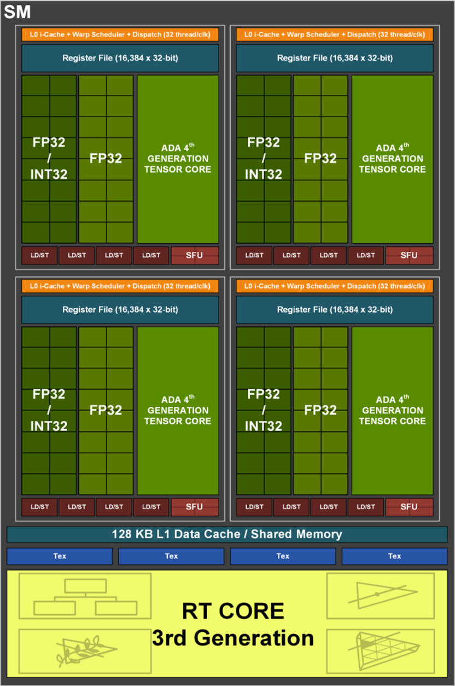

### 相关术语

FLOPs表示FLOP的复数形式

FLOPS表示每秒浮点运算次数，单位是FLOPs/s

### 异步拷贝

在看“如何减少其它地方寄存器的使用量”的时候看到一篇文章，里面提及使用s_xxx[idx] = d_xxx[idx]形式的，从global memory看似'一步到位'写入到shared memory的做法。实际上会被编译成中间的分步的tmp = d_xxx[idx]; s_xxx[idx] = tmp; 的经过寄存器(tmp)的分解过程，导致中间第二次写入的时候有一次对寄存器的依赖。建议计算能力8.6和8.7的设备时，可以考虑新版的cuda::memcpy_async载入方式

ncu采样没有看到什么区别，于是去检索了下GPU数据拷贝模式，发现现代处理器体系主要是加载/储存架构。此架构的基本原则是：计算只能在寄存器上进行、内存访问通过专门指令完成

从GMEM到SMEM间的数据搬运过程会占用CUDA core 执行LDG（加载全局内存）以及STS（存储共享内存）指令

使用 `cuda::memcpy_async` 不仅可以异步拷贝数据，还可以空余CUDA core，利用TMA，理论上来说会有一定的优化

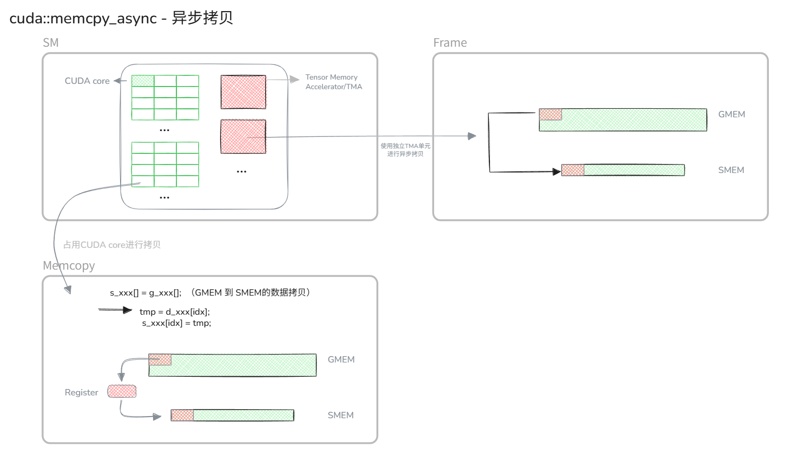


## 参考文献

[https://siboehm.com/articles/22/CUDA-MMM](https://siboehm.com/articles/22/CUDA-MMM)

[https://github.com/siboehm/SGEMM_CUDA](https://github.com/siboehm/SGEMM_CUDA)

[https://docs.nvidia.com/nsight-compute/ProfilingGuide/index.html#metrics-reference](https://docs.nvidia.com/nsight-compute/ProfilingGuide/index.html#metrics-reference)


