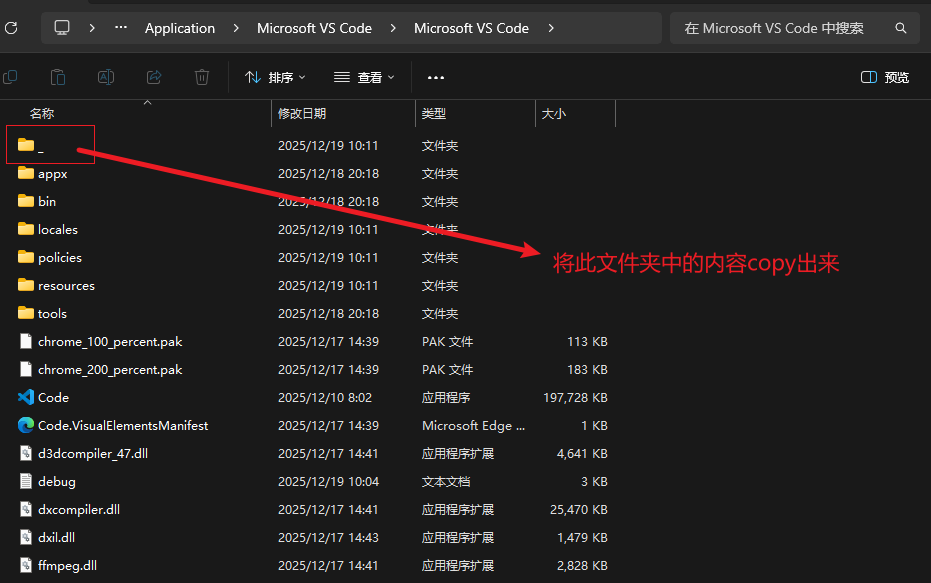

# VSCode 无法打开问题修复

## 前言&问题描述

> 早上接到学长的通知，需要对比赛赛题细节进行确认，头也没吹完就赶到实验室看代码。打开电脑，却发现VScode打不开...

## 问题定位

打开终端，执行，执行code --verbose指令，查看启动详细日志

> code是vscode程序注册的终端命令别名（可执行命令）,本质上指向 VS Code 的可执行程序（`.exe` 文件）。

> `--verbose`（简写 `-v`，部分程序支持）是**通用型调试参数**，核心作用是让**程序启动 / 运行时**输出**详细的日志信息**（“verbose” 本意是 “冗长的、详尽的”），把原本隐藏在后台的执行过程、状态、错误、资源加载等细节全部暴露出来。

出现报错：

```Shell
C:\Users\Ziyoung>code --verbose
[1219/100101.879:ERROR:base\i18n\icu_util.cc:223] Invalid file descriptor to ICU data received.
```

问题原因：**VS Code 依赖的 ICU 组件文件损坏 / 缺失**

## 解决方案

### 尝试过的解决方案：

> 清理 VS Code 残留进程，尝试通过万能重启修复环境】

杀进程+重启（无用）

### 最终解决方案

定位到 VSCode 安装目录（我这里是 `D:\Application\Microsoft VS Code\Microsoft VS Code`)，查看是否存在“_”文件夹。

若存在，则将“_”文件夹中的内容 copy 至外层文件夹内。



文件复制完后即可正常启动 VSCode 程序。

### 参考文章：

[https://www.zhihu.com/question/1920173192628118511](https://www.zhihu.com/question/1920173192628118511)
