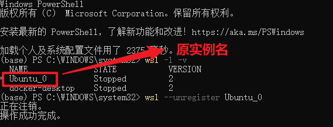
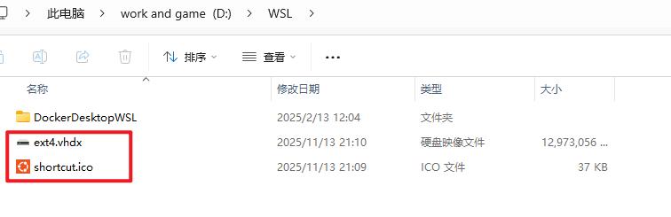
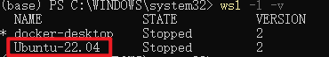

# WSL 移植

## 步骤概览

```Shell
# 查看WSL名称及状态，如 Ubuntu_0
wsl -l -v  
# 关闭所有WSL实例
wsl --shutdown  
# 将 WSL 系统打包为 tar 文件
# wsl --export <发行版名称> <备份文件路径> 
wsl --export Ubuntu_0 D:\wsl - backup.tar 
# 注销原发行版
wsl --unregister Ubuntu_0 
# 创建wsl实例存放目录，如 D:\WSL
# wsl --import <发行版名称> <目标目录路径> <备份文件路径> --version 2
wsl --import Ubuntu-22.04 D:\WSL D:\Ubuntu-backup.tar --version 2
```

## 查看WSL名称及状态

在管理员身份下打开 powershell

执行命令

```Shell
wsl -l -v  # 查看WSL名称及状态，如 Ubuntu_0）
```

示例输出

```Shell
(base) PS C:\WINDOWS\system32> wsl -l -v
  NAME              STATE           VERSION
* Ubuntu_0          Stopped         2
  docker-desktop    Stopped         2
```



这里的 Ubuntu_0 即是待迁移实例名

## 关闭WSL实例

执行命令

```Shell
wsl --shutdown  # 关闭所有WSL实例
```

## 打包待迁移实例

```Shell
# 将 WSL 系统打包为 tar 文件
# wsl --export <实例名> <备份文件路径> 
wsl --export Ubuntu_0 D:\wsl - backup.tar 
```

## 注销原发行版

```Shell
# 注销原发行版
# wsl --unregister <实例名>
wsl --unregister Ubuntu_0 
```

## 创建wsl实例存放目录

我是在 D:\ 下创建了一个 WSL 文件夹，对应路径 `D:\WSL`

## 迁移实例

```Shell
# wsl --import <实例名> <目标目录路径> <备份文件路径> --version 2
wsl --import Ubuntu-22.04 D:\WSL D:\Ubuntu-backup.tar --version 2
```

## 查看迁移是否成功

1. 查看目标路径，若迁移成功，则会出现以下文件



1. 执行命令，查看实例是否创建成功

```Shell
wsl -l -v
```



Congratulation！迁移成功！

> 记得删除备份出来的实例哦
