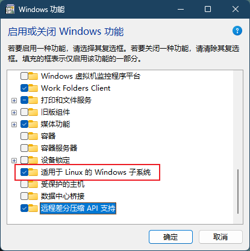
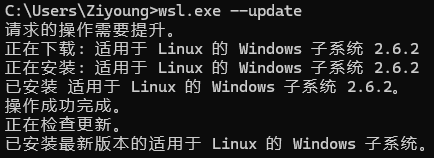
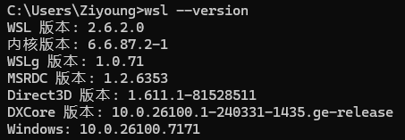
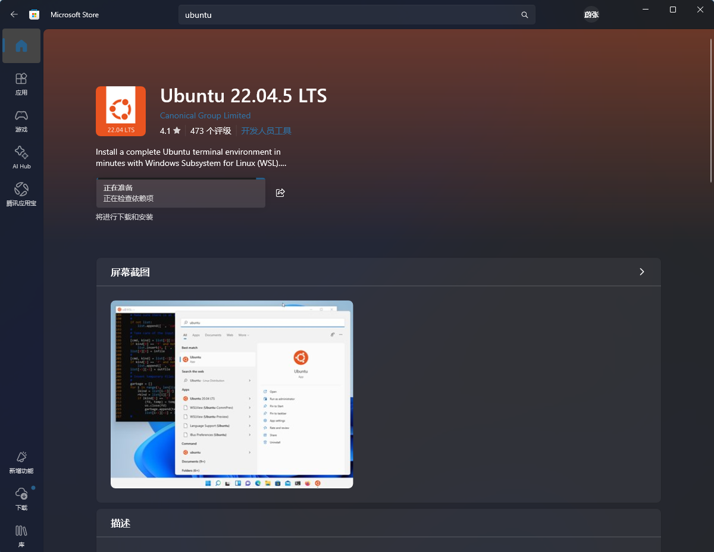
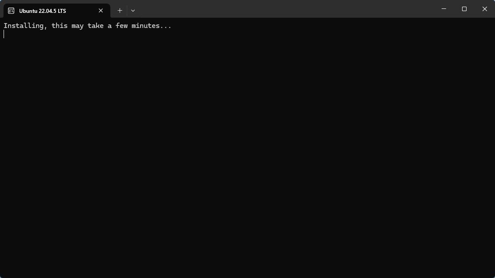
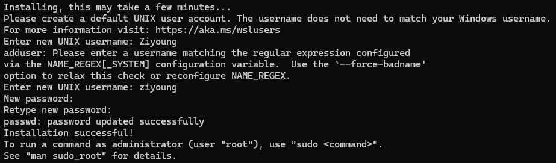
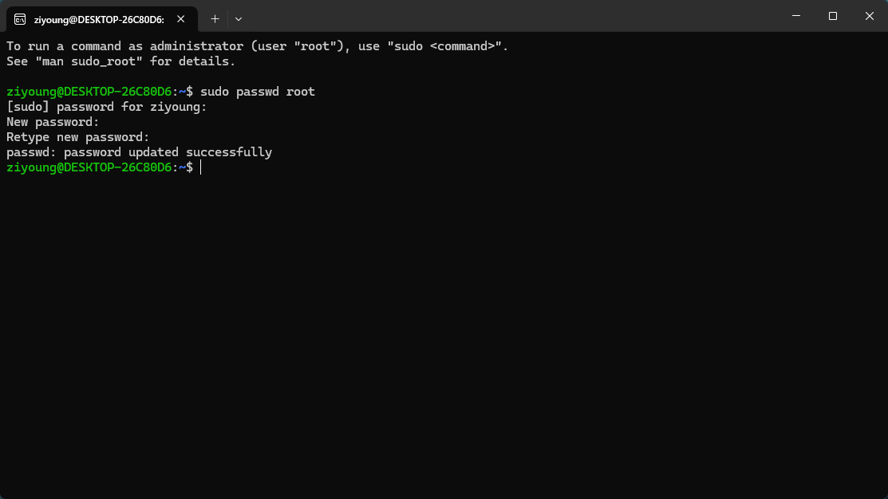

# WSL2 安装与初始化指南

WSL（Windows Subsystem for Linux）让我们可以直接在 Windows 上运行 Linux 二进制程序，不需要额外配置双系统，也不必承担传统虚拟机的明显资源开销。对于需要命令行工具链、容器环境或类 Linux 开发体验的场景，WSL2 已经是 Windows 平台上非常实用的一套方案。

这篇文章记录一套从系统前置条件检查，到安装发行版，再到完成首次账号初始化的完整流程。

## 安装前提条件

在正式安装 WSL2 之前，先确认以下两项已经开启：

1. 已启用 CPU 虚拟化技术
2. 已启用 WSL2 所需的 Windows 可选功能

### 开启系统功能

按下 `Win + R` 打开运行对话框，输入以下命令并回车：

`optionalfeatures`

随后勾选以下选项：

- `Virtual Machine Platform`
- `适用于 Linux 的 Windows 子系统`

完成后点击确定，并按照系统提示立即重启。

如果你的使用场景还需要更完整的微软虚拟化能力，可以再按需启用 `Hyper-V`，但它并不是 WSL2 首次安装的必选项。

## 安装 WSL

打开 `cmd` 或 Windows Terminal，先执行下面的命令安装 WSL：

`wsl --install`

首次安装完成后，如需更新 WSL 组件，再执行：

`wsl.exe --update`

安装或更新完成后，可以继续执行下面的命令确认当前版本信息：

`wsl --version`

如果能够正常输出版本号，说明 WSL 组件已经可用。

## 安装 Linux 发行版

接下来需要安装一个 Linux 发行版。最方便的方式是直接在微软商店中搜索并下载。

这里以 `Ubuntu 22.04.5 LTS` 为例。

下载安装完成后，打开对应的 Linux 发行版。

第一次启动时出现初始化加载界面是正常现象，等待完成即可。

## 实例初始化

发行版首次启动完成后，需要先完成账户初始化。

### 设置普通用户账号和密码

根据终端提示输入用户名与密码。

输入密码时终端不会显示字符，这是 Linux 终端中的正常保密行为。

### 设置 root 用户密码

新建实例默认不会预设 root 密码，因此如果后续需要切换 root 用户或做更高权限的管理操作，可以手动设置。

在 Ubuntu 终端中执行：

`sudo passwd root`

然后按照提示输入当前用户密码，并为 root 设置新密码。

## 总结

完成以上步骤后，你的 WSL2 基础环境就已经可以正常使用了。后续无论是安装开发工具链、配置 Git、运行 Docker，还是搭建 Python、C/C++、Node.js 等开发环境，都可以直接在这个 Linux 实例中继续进行。

如果你是第一次在 Windows 上接触 Linux 开发环境，那么从 WSL2 开始会是一个相对平滑、成本也较低的选择。
